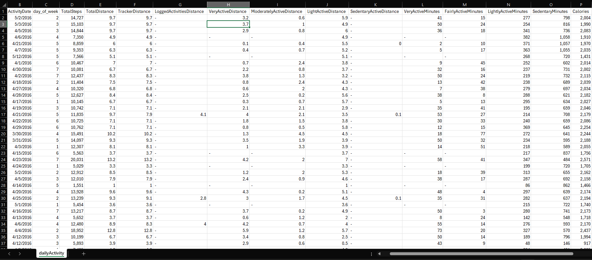

## Introduction:

This project centers on analyzing the usage patterns of Bellabeat’s smart device users, with a focus on identifying actionable insights for marketing strategies. Following the structured data analysis process from the Google Data Analytics course, the project adheres to the six key steps: Ask, Prepare, Process, Analyze, Share, and Act. The goal is to help Bellabeat utilize smart device data to enhance growth opportunities.

The analysis is designed to demonstrate various data analytics skills and techniques while maintaining a clear focus on delivering insights that align with Bellabeat's business goals.

**Data Analysis Process**
  - Ask: Identify the problem or question to solve.
  - Prepare: Collect and organize the necessary data.
  - Process: Clean and transform the data for analysis.
  - Analyze: Explore the data to find insights and patterns.
  - Share: Present your findings with clear visuals and recommendations.
  - Act: Provide actionable steps based on the analysis.

## Step 1: Ask

**Project Background:**

This case study focuses on Bellabeat, a wellness technology company that designs health-oriented smart products for women. The company seeks to leverage data from its devices to better understand user behavior and enhance its marketing strategies. By analyzing this data, Bellabeat aims to identify patterns and trends that can drive business growth and customer engagement.

The company’s Chief Creative Officer, Urška Sršen, believes that deeper insights into smart device usage will reveal new opportunities for market expansion. This analysis will concentrate on one of Bellabeat’s products, with the findings intended to guide future marketing initiatives and help the company strengthen its presence in the competitive wellness technology market.

**Business Problem:**

Bellabeat needs to develop a more data-driven marketing strategy by leveraging the data collected from its smart devices. The company currently lacks a detailed understanding of user behavior, which limits its ability to tailor marketing campaigns and optimize product offerings. A deeper analysis of user data will enable Bellabeat to uncover insights that will drive growth and enhance customer engagement.

**Goals:**

The main objective of the analysis is to answer the key question about user behavior with Bellabeat products. The findings will support answering the following questions:
1.	What are the key trends and patterns in smart device usage among Bellabeat customers?
2.	How can these insights be applied to Bellabeat’s marketing strategy to enhance customer engagement and acquisition?

**Stakeholders:**

Characters:
  
   -	Urška Sršen: Co-founder and Chief Creative Officer of Bellabeat.
   -	Sando Mur: Mathematician, co-founder, and a key member of the Bellabeat executive team.
   -	Bellabeat Marketing Analytics Team: A group responsible for collecting, analyzing, and reporting data to drive marketing strategies.

Products:
  
   -	Bellabeat App: Tracks user activity, sleep, stress, and mindfulness habits, offering personalized health insights.
   -	Leaf: A wearable wellness tracker that connects to the Bellabeat app to monitor activity, sleep, and stress.
   -	Time: A smartwatch that tracks wellness metrics and provides insights via the Bellabeat app.
   -	Spring: A smart water bottle that monitors hydration levels through the app.
   -	Bellabeat Membership: A subscription service offering personalized wellness guidance.

## Step 2: Prepare

**Data Sources:**

For this analysis, the following dataset will be utilized:
- Fitbit Fitness Tracker Data (CC0: Public Domain, Kaggle): This dataset includes personal fitness tracker data from 30 consenting Fitbit users, comprising minute-level metrics related to physical activity, heart rate, and sleep monitoring. It offers detailed information on daily activity, steps, heart rate, and sleep patterns, facilitating an exploration of user habits.
  
**Data Collection:**

The dataset is structured across multiple CSV files, each representing different types of fitness data collected from March 12, 2016, to May 12, 2016. Key components include:
- Daily Activity: Metrics related to steps taken, distance traveled, and calories burned.
- Heart Rate Monitoring: Data on heart rate measurements.
- Sleep Monitoring: Data regarding sleep duration.
- Weight Monitoring: Data on weight and BMI (Body Mass Index).

This dataset, sourced from the Mobius Kaggle repository, is in the public domain and compliant with licensing and privacy regulations. It has been anonymized, and users have consented to the use of their data for analysis.

**Data Description:**

Each table in the dataset provides unique insights and is linked by a common ID field. Below is a sample from the dailyActivity_merged.csv file, which combines multiple data sources into a single file.	

| No. | Name | Description |
|-----|------|-------------|
| 01  | Id | Unique identifier for each user. |
| 02  | ActivityDate | Date of the recorded data. |
| 03  | TotalSteps | Total number of steps taken.|
| 04  | TotalDistance | Total distance moved. |
| 05  | TrackerDistance | Total distance recorded by the tracker. |
| 06  | LoggedActivitiesDistance | Manually logged distance moved. |
| 07  | VeryActiveDistance | Distance traveled at a high activity level. |
| 08  | ModeratelyActiveDistance | Distance traveled at a moderate activity level. |
| 09  | LightActiveDistance |  Distance traveled at a light activity level. |
| 10  | SedentaryActiveDistance | Distance recorded during sedentary activity. |
| 1  | VeryActiveMinutes | Minutes spent in very active exercise. |
| 12  | FairlyActiveMinutes | Minutes spent in fairly active exercise. |
| 13  | LightlyActiveMinutes | Minutes spent in lightly active exercise. |
| 14  | SedentaryMinutes | Minutes spent in sedentary activity. |
| 15  | Calories | Total number of calories burned. |

These variables are essential for analyzing user engagement and behavior with fitness trackers.

**Addressing Privacy and Accessibility:**

The dataset is publicly available and fully anonymized, addressing privacy and security concerns. The exclusion of PII, such as names or contact details, ensures compliance with privacy standards. Additionally, the data is accessible in .csv format, which is versatile and can easily be imported into tools like R, SQL, and Tableau for analysis.

**Data Integrity:**

Ensuring data integrity is essential for generating reliable insights. The following steps were implemented to verify and maintain data quality:
- **Duplicate Data:** A check for duplicate entries will ensure that each ride is logged only once. Any duplicates found will be removed to prevent skewed results.
- **Missing Data:** Missing or incomplete entries will be identified. These records will either be cleaned or excluded from the analysis, depending on the extent and impact of the missing data.
- **Outliers:** Extreme values will be reviewed to determine if they represent legitimate data points or errors. Any unjustifiable outliers may be excluded to avoid distorting the analysis.
- **Data Types:** Each variable will be validated to ensure the correct data types are used.

These steps will ensure that the dataset is clean, consistent, and reliable, enabling accurate insights and valid business conclusions.

**Data Credibility (ROCCC Framework):**

To assess the credibility of the data, we apply the ROCCC framework, focusing on:
- Reliable: The data is sourced directly from Fitbit trackers, ensuring accurate reporting of user metrics.
- Original: This is first-party data collected by Fitbit, enhancing its authenticity.
- Comprehensive: The dataset contains all necessary variables for understanding user habits, from activity levels to sleep patterns.
- Current: Collected in 2016, the dataset may limit relevance due to shifts in user behavior and technology.
- Cited: The dataset is licensed by Mobius and is available under CC0 (Public Domain).

**How the Data Answers the Business Question:**

The Fitbit dataset is crucial for answering the core question of how smart device users engage with fitness trackers. By analyzing various metrics, insights can be drawn regarding user behaviors, such as:
- **Activity Patterns:** Exploring correlations between daily steps, heart rate, and sleep quality to understand wellness.
- **Engagement Timing:** Identifying trends in activity timing, such as increased engagement at certain times of the day or week.
- **Health Outcomes:** Analyzing relationships between activity levels and sleep quality to inform wellness promotion strategies.

**Potential Data Issues:**

While the dataset is robust, there are several limitations to consider:
- **Limited Demographic Data:** The absence of demographic information (e.g., age, gender) restricts further user segmentation.
- **Sample Size:** The small sample of 30 users may not represent broader user behavior comprehensively.
- **Not Current:** The data, collected in 2016, may not reflect recent user engagement trends.
- **Short Time Range:** Covering only two months of data, it provides limited insights into long-term trends.

Despite these limitations, the dataset remains robust and offers sufficient depth to generate valuable insights into user behavior with fitness trackers.

## Step 3: Process

**Overview:**

In this phase, the Bellabeat FitBit fitness tracker data is processed and cleaned in accordance with the guidelines outlined in the Project Charter. The objective is to ensure that the data is ready for analysis, encompassing tasks such as cleaning, merging, and transforming. The primary steps in the data processing phase include:

1.	**Data Cleaning:** This entails resolving formatting issues, addressing null or missing values, removing duplicate records, and rectifying any other inconsistencies that could compromise data quality.
2.	**Merging and Transforming:** The files based on their time scale, (day, hour, minute, second) will be combined into a merged datasets and transformed into a format conducive to analysis.

The Project Charter specifies three methodologies for data processing and analysis: Excel, SQL, and R. While Excel is a valuable tool, it is less optimal for large datasets due to its file size constraints. In practical applications, SQL or R would be more suitable for managing extensive data. For this portfolio project, all three methods are demonstrated to showcase a range of technical skills.

**Data Overview:**

The dataset utilized in this analysis consists of 29 files containing various health and wellness datapoints collected over a two-month period. 

### Review and Processing Steps:

**Step 1: File Setup and Data Merging**

  -	  Unzip the files.
  -	  Store the .csv files in a designated folder for efficient management of the raw data.
  -	  Review the original files and merge them into a merged datasets based on time scale. (day, hour, minute, second)

**Step 2: Data Cleaning**

The following quality checks were performed to ensure the integrity of the data:
  1.	**Column Name Consistency:** Ensured that column names across all files adhered to consistent naming conventions. Any discrepancies were standardized to maintain uniformity.
  2.	**Data Type Consistency:** Verified that the correct and consistent data types were applied across all relevant columns.
  3.	**Duplicate Records:** Identified and removed duplicate entries within the dataset.
  4.	**Missing or Null Values:** Detected missing or null values in key columns and removed rows with critical missing information.
  5.	**Inconsistent Data:** Checked for data inconsistencies and made corrections where feasible.

**Step 3: Data Transformation**

To prepare the dataset for analysis, the following transformation was applied:
1.	**Creating a ‘Day of Week’ Column:**
    -  **Description:** A new column was created to capture the day of the week for each entry, enabling the analysis of patterns based on weekday versus weekend usage.
    -  **Tool-Specific Notes:**
        -  **Excel:** =WEEKDAY(C2, 1)
        -  **SQL:** day_of_week = EXTRACT(DOW FROM ActivityDate) + 1 
        -  **R:** day_of_week = as.integer(format(ActivityDate, "%w")) + 1

### Tool-Specific Approaches

**Excel Approach**

While Excel is widely utilized for data analysis, it is not well-suited for handling very large datasets due to memory limitations. Excel can accommodate up to 1,048,575 rows per worksheet, which may restrict its use for large-scale analysis. The following steps were performed using Excel:

Step 1: File Setup and Data Merging:

Power Query was omitted due to data consistency issues across files, which limited its utility in this analysis. The two dailyActivity_merged.csv files were combined for each month, while other daily merged files were excluded due to minimal relevance. The hourly merged files will be used for more detailed analysis. Given that the dataset exceeds Excel’s row limit of 1,048,575, full analysis using this method was impractical.
  - Utilized INDEX and MATCH functions to consolidate data into a single workbook efficiently.

Step 2: Data Cleaning: 

The “Remove Duplicates” function identified and removed duplicates within the manageable dataset subset.

Step 3: Data Transformation: 

Formulas were applied to calculate key metrics:
  - Day of week: =WEEKDAY(C2, 1) (Returns the day of the week based on the start time).



> Note: The large size of the dataset exceeded Excel's capacity for handling data. Although Excel is effective for small to medium-sized datasets, SQL and R are more suitable for managing datasets of this scale.

**SQL Approach**

While SQL is a powerful and efficient tool for managing large datasets, it is well-suited for structured data analysis on databases. The following steps were performed using PostgreSQL to ensure the dataset was ready for in-depth analysis:

Step 1: File Setup and Data Merging:

The .csv files were imported into the public.daily_activity  table using PostgreSQL's COPY command. 
  - Create table to store dataset: A new table named daily_activity was created in PostgreSQL to hold the dataset. The table structure was defined with appropriate data types for each column, ensuring compatibility with the data in the .csv files.
  - Importing the .csv files: PostgreSQL’s COPY command was used to import the .csv files directly into the daily_activity table. 

Step 2: Data Cleaning: 

Data cleaning is crucial to ensure the dataset is accurate and suitable for analysis. Several steps were implemented to clean the data:
  - Removing duplicates: Duplicate records were identified and removed based on the Id and ActivityDate using PostgreSQL’s ROW_NUMBER() function.
  - Removing rows with NULL values: Rows with NULL values in critical columns (e.g., ActivityDate, TotalSteps, and Calories) were removed.
  - Removing outliers: Records where the Calories burned was 0 or less were filtered out.

Step 3: Data Transformation:

To prepare the dataset for analysis, transformations were applied to create new columns and extract relevant features:
  - Extracting the day of the week: A new column, day_of_week, was added to extract the day of the week from the ActivityDate timestamp. The days of the week were represented as integers, where 1 = Sunday and 7 = Saturday.

SQL QUERIES:
``` sql
/*
PREPARE DATA
*/

-- Create primary table to store FitBit Fitness Tracker Data. 

CREATE TABLE IF NOT EXISTS public.daily_activity (
	Id VARCHAR(50),						-- Unique identifier for each user. 
	ActivityDate TIMESTAMP,					-- Date of the recorded data.  
	TotalSteps INT,						-- Total number of steps taken.|
	TotalDistance FLOAT,					-- Total distance moved. 
	TrackerDistance FLOAT,					-- Total distance recorded by the tracker. 
	LoggedActivitiesDistance FLOAT,				-- Manually logged distance moved. 
	VeryActiveDistance FLOAT,				-- Distance traveled at a high activity level. 
	ModeratelyActiveDistance FLOAT,				-- Distance traveled at a moderate activity level. 
	LightActiveDistance FLOAT,				-- Distance traveled at a light activity level. 
 	SedentaryActiveDistance FLOAT,				-- Distance recorded during sedentary activity. 
	VeryActiveMinutes INT,					-- Minutes spent in very active exercise. 
	FairlyActiveMinutes INT,				-- Minutes spent in fairly active exercise. 
	LightlyActiveMinutes INT,				-- Minutes spent in lightly active exercise. 
	SedentaryMinutes INT,   				-- Minutes spent in sedentary activity. 
	Calories INT						-- Total number of calories burned. 
);

CREATE TABLE IF NOT EXISTS public.hourly_activity (
	Id VARCHAR(50),						-- Unique identifier for each user. 
	ActivityHour TIMESTAMP,					-- Date and Time of the recorded data.  
	TotalIntensity INT,					-- Total Intensity per hour.
	AverageIntensity FLOAT,					-- Average Intensity per hour.
	StepTotal INT,						-- Total Steps per hour.
	Calories FLOAT						-- Total Calories per hour. 
);

CREATE TABLE IF NOT EXISTS public.minute_activity (
	Id VARCHAR(50),						-- Unique identifier for each user. 
	ActivityMinute TIMESTAMP,				-- Date and Time of the recorded data.  
	Steps INT,						-- Total Steps per minaute.
	Calories FLOAT,						-- Total Calories per minute.
	METs INT,						-- Metabolic equivalents (METs) per minute.
	Intensity INT,						-- Intensity per minute.
	value INT,						-- Sleep value per minute.
	logId VARCHAR(50)					-- Sleep log ID number.
);

CREATE TABLE IF NOT EXISTS public.second_activity (
	Id VARCHAR(50),						-- Unique identifier for each user. 
	Time TIMESTAMP,						-- Date and Time of the recorded data.  
	Value INT						-- Heart rate per second. 
);

CREATE TABLE IF NOT EXISTS public.sleepday_merged (
	Id VARCHAR(50),						-- Unique identifier for each user. 
	SleepDay TIMESTAMP,					-- Date and Time of the recorded data.  
    	TotalSleepRecords INT,					-- Total number of sleep cycles recorded.
    	TotalMinutesAsleep INT,					-- Total minutes the user was asleep.
    	TotalTimeInBed INT					-- Total minutes the user spent in bed.
);

-- Create temporary tables to allow for .csv files with differing column names to be imported for later inserting into appropriate tables.

CREATE TEMP TABLE staging_hourlyCalories_merged (
	Id VARCHAR(50),						-- Unique identifier for each user. 
	ActivityHour TIMESTAMP,					-- Date and Time of the recorded data.  
	Calories FLOAT						-- Total Calories per hour. 
);

CREATE TEMP TABLE staging_hourlyCalories_merged2 (
	Id VARCHAR(50),						-- Unique identifier for each user. 
	ActivityHour TIMESTAMP,					-- Date and Time of the recorded data.  
	Calories FLOAT						-- Total Calories per hour. 
);

CREATE TEMP TABLE staging_hourlyIntensities_merged (
	Id VARCHAR(50),						-- Unique identifier for each user. 
	ActivityHour TIMESTAMP,					-- Date and Time of the recorded data.  
	TotalIntensity INT,					-- Total Intensity per hour.
	AverageIntensity FLOAT					-- Average Intensity per hour.
);

CREATE TEMP TABLE staging_hourlyIntensities_merged2 (
	Id VARCHAR(50),						-- Unique identifier for each user. 
	ActivityHour TIMESTAMP,					-- Date and Time of the recorded data.  
	TotalIntensity INT,					-- Total Intensity per hour.
	AverageIntensity FLOAT					-- Average Intensity per hour.
);

CREATE TEMP TABLE staging_hourlySteps_merged (
	Id VARCHAR(50),						-- Unique identifier for each user. 
	ActivityHour TIMESTAMP,					-- Date and Time of the recorded data.  
	StepTotal INT						-- Total Steps per hour.
);

CREATE TEMP TABLE staging_hourlySteps_merged2 (
	Id VARCHAR(50),						-- Unique identifier for each user. 
	ActivityHour TIMESTAMP,					-- Date and Time of the recorded data.  
	StepTotal INT						-- Total Steps per hour.
);

CREATE TEMP TABLE staging_minuteCaloriesNarrow_merged (
	Id VARCHAR(50),						-- Unique identifier for each user. 
	ActivityMinute TIMESTAMP,				-- Date and Time of the recorded data.  
	Calories FLOAT						-- Total Calories per minute.
);

CREATE TEMP TABLE staging_minuteCaloriesNarrow_merged2 (
	Id VARCHAR(50),						-- Unique identifier for each user. 
	ActivityMinute TIMESTAMP,				-- Date and Time of the recorded data.  
	Calories FLOAT						-- Total Calories per minute.
);

CREATE TEMP TABLE staging_minuteIntensitiesNarrow_merged (
	Id VARCHAR(50),						-- Unique identifier for each user. 
	ActivityMinute TIMESTAMP,				-- Date and Time of the recorded data.  
	Intensity INT						-- Intensity per minute.
);

CREATE TEMP TABLE staging_minuteIntensitiesNarrow_merged2 (
	Id VARCHAR(50),						-- Unique identifier for each user. 
	ActivityMinute TIMESTAMP,				-- Date and Time of the recorded data.  
	Intensity INT						-- Intensity per minute.
);

CREATE TEMP TABLE staging_minuteStepsNarrow_merged (
	Id VARCHAR(50),						-- Unique identifier for each user. 
	ActivityMinute TIMESTAMP,				-- Date and Time of the recorded data.  
	Steps INT						-- Total Steps per minaute.
);

CREATE TEMP TABLE staging_minuteStepsNarrow_merged2 (
	Id VARCHAR(50),						-- Unique identifier for each user. 
	ActivityMinute TIMESTAMP,				-- Date and Time of the recorded data.  
	Steps INT						-- Total Steps per minaute.
);

CREATE TEMP TABLE staging_minuteMETsNarrow_merged (
	Id VARCHAR(50),						-- Unique identifier for each user. 
	ActivityMinute TIMESTAMP,				-- Date and Time of the recorded data.  
	METs INT						-- Metabolic equivalents (METs) per minute.
);

CREATE TEMP TABLE staging_minuteMETsNarrow_merged2 (
	Id VARCHAR(50),						-- Unique identifier for each user. 
	ActivityMinute TIMESTAMP,				-- Date and Time of the recorded data.  
	METs INT						-- Metabolic equivalents (METs) per minute.
);

CREATE TEMP TABLE staging_minuteSleep_merged (
	Id VARCHAR(50),						-- Unique identifier for each user. 
	ActivityMinute TIMESTAMP,				-- Date and Time of the recorded data.  
	value INT,						-- Sleep value per minute.
	logId VARCHAR(50)					-- Sleep log ID number.
);

CREATE TEMP TABLE staging_minuteSleep_merged2 (
	Id VARCHAR(50),						-- Unique identifier for each user. 
	ActivityMinute TIMESTAMP,				-- Date and Time of the recorded data.  
	value INT,						-- Sleep value per minute.
	logId VARCHAR(50)					-- Sleep log ID number.
);

-- Import data from the .csv files into the `public.daily_activity` table

COPY public.daily_activity (Id,ActivityDate,TotalSteps,TotalDistance,TrackerDistance,LoggedActivitiesDistance,VeryActiveDistance,ModeratelyActiveDistance,LightActiveDistance,SedentaryActiveDistance,VeryActiveMinutes,FairlyActiveMinutes,LightlyActiveMinutes,SedentaryMinutes,Calories)
FROM '\Fitabase Data 3.12.16-4.11.16\dailyActivity_merged.csv' 
DELIMITER ',' CSV header;
COPY public.daily_activity (Id,ActivityDate,TotalSteps,TotalDistance,TrackerDistance,LoggedActivitiesDistance,VeryActiveDistance,ModeratelyActiveDistance,LightActiveDistance,SedentaryActiveDistance,VeryActiveMinutes,FairlyActiveMinutes,LightlyActiveMinutes,SedentaryMinutes,Calories)
FROM '\Fitabase Data 4.12.16-5.12.16\dailyActivity_merged.csv' 
DELIMITER ',' CSV header;

-- Import data from the .csv files into Hourly Temporary Tables.

COPY staging_hourlyCalories_merged (Id,ActivityHour,Calories)
FROM '\Fitabase Data 3.12.16-4.11.16\hourlyCalories_merged.csv' 
DELIMITER ',' CSV header;
COPY staging_hourlyCalories_merged2 (Id,ActivityHour,Calories)
FROM '\Fitabase Data 4.12.16-5.12.16\hourlyCalories_merged.csv' 
DELIMITER ',' CSV header;
COPY staging_hourlyIntensities_merged (Id,ActivityHour,TotalIntensity,AverageIntensity)
FROM '\Fitabase Data 3.12.16-4.11.16\hourlyIntensities_merged.csv' 
DELIMITER ',' CSV header;
COPY staging_hourlyIntensities_merged2 (Id,ActivityHour,TotalIntensity,AverageIntensity)
FROM '\Fitabase Data 4.12.16-5.12.16\hourlyIntensities_merged.csv' 
DELIMITE ',' CSV header;
COPY staging_hourlySteps_merged (Id,ActivityHour,StepTotal)
FROM '\Fitabase Data 3.12.16-4.11.16\hourlySteps_merged.csv' 
DELIMITER ',' CSV header;
COPY staging_hourlySteps_merged2 (Id,ActivityHour,StepTotal)
FROM '\Fitabase Data 4.12.16-5.12.16\hourlySteps_merged.csv' 
DELIMITER ',' CSV header;

-- Import data from the .csv files into Minute Temporary Tables.

COPY staging_minuteCaloriesNarrow_merged (Id,ActivityMinute,Calories)
FROM '\Fitabase Data 3.12.16-4.11.16\minuteCaloriesNarrow_merged.csv' 
DELIMITER ',' CSV header;
COPY staging_minuteCaloriesNarrow_merged2 (Id,ActivityMinute,Calories)
FROM '\Fitabase Data 4.12.16-5.12.16\minuteCaloriesNarrow_merged.csv' 
DELIMITER ',' CSV header;
COPY staging_minuteIntensitiesNarrow_merged (Id,ActivityMinute,Intensity)
FROM '\Fitabase Data 3.12.16-4.11.16\minuteIntensitiesNarrow_merged.csv' 
DELIMITER ',' CSV header;
COPY staging_minuteIntensitiesNarrow_merged2 (Id,ActivityMinute,Intensity)
FROM '\Fitabase Data 4.12.16-5.12.16\minuteIntensitiesNarrow_merged.csv' 
DELIMITER ',' CSV header;
COPY staging_minuteStepsNarrow_merged (Id,ActivityMinute,Steps)
FROM '\Fitabase Data 3.12.16-4.11.16\minuteStepsNarrow_merged.csv' 
DELIMITER ',' CSV header;
COPY staging_minuteStepsNarrow_merged2 (Id,ActivityMinute,Steps)
FROM '\Fitabase Data 4.12.16-5.12.16\minuteStepsNarrow_merged.csv' 
DELIMITER ',' CSV header;
COPY staging_minuteMETsNarrow_merged (Id,ActivityMinute,METs)
FROM '\Fitabase Data 3.12.16-4.11.16\minuteMETsNarrow_merged.csv' 
DELIMITER ',' CSV header;
COPY staging_minuteMETsNarrow_merged2 (Id,ActivityMinute,METs)
FROM '\Fitabase Data 4.12.16-5.12.16\minuteMETsNarrow_merged.csv' 
DELIMITER ',' CSV header;
COPY staging_minuteSleep_merged (Id,ActivityMinute,value,logId)
FROM '\Fitabase Data 3.12.16-4.11.16\minuteSleep_merged.csv' 
DELIMITER ',' CSV header;
COPY staging_minuteSleep_merged2 (Id,ActivityMinute,value,logId)
FROM '\Fitabase Data 4.12.16-5.12.16\minuteSleep_merged.csv' 
DELIMITER ',' CSV header;

-- Import data from the .csv files into the `public.second_activity` table

COPY public.second_activity (Id,Time,Value)
FROM '\Fitabase Data 3.12.16-4.11.16\heartrate_seconds_merged.csv' 
DELIMITER ',' CSV header;
COPY public.second_activity (Id,Time,Value)
FROM '\Fitabase Data 4.12.16-5.12.16\heartrate_seconds_merged.csv' 
DELIMITER ',' CSV header;

-- Insert hourly temporary tables into 'public.hourly_activity'.

INSERT INTO public.hourly_activity (Id, ActivityHour, Calories, TotalIntensity, AverageIntensity, StepTotal)
SELECT
    COALESCE(c1.Id, i1.Id, s1.Id, c2.Id, i2.Id, s2.Id) AS Id,
    COALESCE(c1.ActivityHour, i1.ActivityHour, s1.ActivityHour, c2.ActivityHour, i2.ActivityHour, s2.ActivityHour) AS ActivityHour,
    COALESCE(c1.Calories, c2.Calories) AS Calories,
    COALESCE(i1.TotalIntensity, i2.TotalIntensity) AS TotalIntensity,
    COALESCE(i1.AverageIntensity, i2.AverageIntensity) AS AverageIntensity,
    COALESCE(s1.StepTotal, s2.StepTotal) AS StepTotal
FROM 
	staging_hourlyCalories_merged c1
	FULL OUTER JOIN staging_hourlyIntensities_merged i1
    	ON c1.Id = i1.Id AND c1.ActivityHour = i1.ActivityHour
	FULL OUTER JOIN staging_hourlySteps_merged s1
    	ON COALESCE(c1.Id, i1.Id) = s1.Id AND COALESCE(c1.ActivityHour, i1.ActivityHour) = s1.ActivityHour
	FULL OUTER JOIN staging_hourlyCalories_merged2 c2
    	ON COALESCE(c1.Id, i1.Id, s1.Id) = c2.Id AND COALESCE(c1.ActivityHour, i1.ActivityHour, s1.ActivityHour) = c2.ActivityHour
	FULL OUTER JOIN staging_hourlyIntensities_merged2 i2
    	ON COALESCE(c1.Id, i1.Id, s1.Id, c2.Id) = i2.Id AND COALESCE(c1.ActivityHour, i1.ActivityHour, s1.ActivityHour, c2.ActivityHour) = i2.ActivityHour
	FULL OUTER JOIN staging_hourlySteps_merged2 s2
    	ON COALESCE(c1.Id, i1.Id, s1.Id, c2.Id, i2.Id) = s2.Id AND COALESCE(c1.ActivityHour, i1.ActivityHour, s1.ActivityHour, c2.ActivityHour, i2.ActivityHour) = s2.ActivityHour;

-- Insert minute temporary tables into 'public.minute_activity'.

INSERT INTO public.minute_activity (Id, ActivityMinute, Calories, Intensity, Steps, METs, value, logId)
SELECT 
    COALESCE(c.Id, i.Id, s.Id, m.Id, sl.Id) AS Id,
    COALESCE(c.ActivityMinute, i.ActivityMinute, s.ActivityMinute, m.ActivityMinute, sl.ActivityMinute) AS ActivityMinute,
    COALESCE(c.Calories, c2.Calories) AS Calories,
    COALESCE(i.Intensity, i2.Intensity) AS Intensity,
    COALESCE(s.Steps, s2.Steps) AS Steps,
    COALESCE(m.METs, m2.METs) AS METs,
    sl.value AS SleepValue,
    sl.logId AS SleepLogId
FROM 
    staging_minuteCaloriesNarrow_merged AS c
    FULL JOIN staging_minuteCaloriesNarrow_merged2 AS c2
        ON c.Id = c2.Id AND c.ActivityMinute = c2.ActivityMinute
    FULL JOIN staging_minuteIntensitiesNarrow_merged AS i
        ON COALESCE(c.Id, c2.Id) = i.Id AND COALESCE(c.ActivityMinute, c2.ActivityMinute) = i.ActivityMinute
    FULL JOIN staging_minuteIntensitiesNarrow_merged2 AS i2
        ON COALESCE(c.Id, c2.Id, i.Id) = i2.Id AND COALESCE(c.ActivityMinute, c2.ActivityMinute, i.ActivityMinute) = i2.ActivityMinute
    FULL JOIN staging_minuteStepsNarrow_merged AS s
        ON COALESCE(c.Id, c2.Id, i.Id, i2.Id) = s.Id AND COALESCE(c.ActivityMinute, c2.ActivityMinute, i.ActivityMinute, i2.ActivityMinute) = s.ActivityMinute
    FULL JOIN staging_minuteStepsNarrow_merged2 AS s2
        ON COALESCE(c.Id, c2.Id, i.Id, i2.Id, s.Id) = s2.Id AND COALESCE(c.ActivityMinute, c2.ActivityMinute, i.ActivityMinute, i2.ActivityMinute, s.ActivityMinute) = s2.ActivityMinute
    FULL JOIN staging_minuteMETsNarrow_merged AS m
        ON COALESCE(c.Id, c2.Id, i.Id, i2.Id, s.Id, s2.Id) = m.Id AND COALESCE(c.ActivityMinute, c2.ActivityMinute, i.ActivityMinute, i2.ActivityMinute, s.ActivityMinute, s2.ActivityMinute) = m.ActivityMinute
    FULL JOIN staging_minuteMETsNarrow_merged2 AS m2
        ON COALESCE(c.Id, c2.Id, i.Id, i2.Id, s.Id, s2.Id, m.Id) = m2.Id AND COALESCE(c.ActivityMinute, c2.ActivityMinute, i.ActivityMinute, i2.ActivityMinute, s.ActivityMinute, s2.ActivityMinute, m.ActivityMinute) = m2.ActivityMinute
    FULL JOIN staging_minuteSleep_merged AS sl
        ON COALESCE(c.Id, c2.Id, i.Id, i2.Id, s.Id, s2.Id, m.Id, m2.Id) = sl.Id AND COALESCE(c.ActivityMinute, c2.ActivityMinute, i.ActivityMinute, i2.ActivityMinute, s.ActivityMinute, s2.ActivityMinute, m.ActivityMinute, m2.ActivityMinute) = sl.ActivityMinute
    FULL JOIN staging_minuteSleep_merged2 AS sl2
        ON COALESCE(c.Id, c2.Id, i.Id, i2.Id, s.Id, s2.Id, m.Id, m2.Id, sl.Id) = sl2.Id AND COALESCE(c.ActivityMinute, c2.ActivityMinute, i.ActivityMinute, i2.ActivityMinute, s.ActivityMinute, s2.ActivityMinute, m.ActivityMinute, m2.ActivityMinute, sl.ActivityMinute) = sl2.ActivityMinute;

-- Import data from the .csv files into the `public.sleepday_merged` table

COPY public.sleepday_merged (Id,SleepDay,TotalSleepRecords,TotalMinutesAsleep,TotalTimeInBed)
FROM '\Fitabase Data 4.12.16-5.12.16\sleepday_merged.csv' 
DELIMITER ',' CSV header;


/*
Process Data
*/

-- Create new column day_of_week to extract the day of the week from the ActivityDate column.

ALTER TABLE public.daily_activity
ADD day_of_week INT;

ALTER TABLE public.hourly_activity
ADD day_of_week INT;

ALTER TABLE public.minute_activity
ADD day_of_week INT;

ALTER TABLE public.second_activity
ADD day_of_week INT;

ALTER TABLE public.sleepday_merged
ADD day_of_week INT;

-- Update the day_of_week column by extracting the day of the week from ActivityDate. (NOTE: 1 = Sunday and 7 = Saturday).

UPDATE public.daily_activity
SET day_of_week = EXTRACT(DOW FROM ActivityDate) + 1;

UPDATE public.hourly_activity
SET day_of_week = EXTRACT(DOW FROM ActivityHour) + 1;

UPDATE public.minute_activity
SET day_of_week = EXTRACT(DOW FROM ActivityMinute) + 1;

UPDATE public.second_activity
SET day_of_week = EXTRACT(DOW FROM Time) + 1;

UPDATE public.sleepday_merged
SET day_of_week = EXTRACT(DOW FROM sleepday) + 1;


```

**R Approach**

R is an advanced statistical programming language that excels in data analysis, visualization, and statistical modeling. The following steps were performed using R to process the dataset and prepare it for analysis:

Step 1: File Setup and Data Merging:

Using the readr and dplyr packages, the .csv files were imported into R and merged into a single dataframe. 
  - The directory containing the .csv files is specified, and the list.files() function is used to list all .csv files in that directory. The pattern = "*.csv" argument ensures that only .csv files are included.
  - The lapply() function applies the read_csv() function from the readr package to each file in the list, reading the data into R.
  - The bind_rows() function from dplyr combines the individual data frames returned by lapply() into a single unified data frame, daily_activity.

Step 2: Data Cleaning:

To ensure the dataset was clean and reliable for analysis, several data cleaning steps were performed using dplyr and base R functions:
  - Removing duplicates: Duplicate entries were removed using the distinct() function.
  - Removing rows with NULL values: Rows with missing values in critical columns were removed using filter() function.
  - Removing outliers: Outliers in Calories were identified and filtered out. Rows with Calories where Calories were listed as 0 were considered outliers and were removed using conditions in the filter() function.

Step 3: Data Transformation: 

Transformations were performed to prepare the data for analysis:
  - Extracting the day of the week: Another new column, day_of_week, is created to extract the day of the week from the ActivityDate timestamp. The day is represented as an integer where 1 = Sunday and 7 = Saturday. The format() function is used to extract the day of the week, and the result is adjusted to fit the desired scale.

R CODE:
``` r
#
#  PREPARE DATA
#

## Install necessary packages and libraries

install.packages("dplyr")
install.packages("lubridate")
install.packages("tidyverse")

library(dplyr)
library(lubridate)
library(ggplot2)
library(readr)
library(scales)
library(tidyverse)

# Set the directory where .csv files are stored

csv_directory <- "/raw_data/"

# List all .csv files in the directory

csv_files <- list.files(path = csv_directory, pattern = "*.csv", full.names = TRUE)

# Read and merge all .csv files into a single data frame using bind_rows

daily_activity <- csv_files %>%
  lapply(read_csv) %>%
  bind_rows()

# Calculate the total row count, count of unique id's, and the number of duplicate records.
# Output: 1,397 rows, 1,373 distinct rows, 24 duplicate rows.

total_count <- nrow(daily_activity)                                       # Calculate total row count
unique_ids <- n_distinct(daily_activity$Id, daily_activity$ActivityDate)  # Calculate count of unique Id's
duplicate_count <- total_count - unique_ids                               # Calculate the number of duplicate records

cat("Total Row Count:", total_count, "\n")
cat("Unique IDs:", unique_ids, "\n")
cat("Duplicate Records:", duplicate_count, "\n")

# Rank duplicates based on Calories, keeping the highest calorie value for each (Id, ActivityDate) combination

daily_activity_ranked <- daily_activity %>%
  arrange(Id, ActivityDate, desc(Calories)) %>%
  group_by(Id, ActivityDate) %>%
  mutate(rank = row_number()) %>%
  ungroup()

# Identify and remove duplicates (keeping the highest calorie record)
# Remove all rows where the rank is greater than 1

daily_activity_cleaned <- daily_activity_ranked %>%
  filter(rank == 1) %>%
  select(-rank)

cat("Total Row Count after Cleaning:", nrow(daily_activity_cleaned), "\n")
cat("Rows Deleted:", total_count - nrow(daily_activity_cleaned), "\n")

# Identify and delete rows with NULL values in key columns. 
# Delete 0 null rows. 

daily_activity_cleaned <- daily_activity_cleaned %>%
  filter(!is.na(Id), !is.na(ActivityDate), !is.na(Calories))

# Identify and delete outliers based on Calories.
# Delete 6 rows

daily_activity_cleaned <- daily_activity_cleaned %>%
  filter(Calories > 0)


#
# Process Data
#

# Create new column day_of_week to extract the day of the week from the ActivityDate column.
# Update the day_of_week column by extracting the day of the week from ActivityDate. (NOTE: 1 = Sunday and 7 = Saturday).

daily_activity_cleaned <- daily_activity_cleaned %>%
  mutate(ActivityDate = as.Date(ActivityDate, format = "%m/%d/%Y")) %>%
  mutate(day_of_week = as.integer(format(ActivityDate, "%w")) + 1) 

sleepDay_merged <- sleepDay_merged %>%
  mutate(SleepDay = as.Date(SleepDay, format = "%m/%d/%Y")) %>%
  mutate(day_of_week = as.integer(format(SleepDay, "%w")) + 1) 


```

## Step 4: Analyze

**Data Analysis Summary:**

The analysis of the Bellabeat fitness tracking data utilized both PostgreSQL and R to extract key insights into user activity levels, sleep patterns, and the relationship between physical activity and sleep quality. The analysis encompassed calculating aggregate statistics, including the mean, median, and mode of daily steps, activity levels, and sleep duration, alongside insightful aggregations based on time of day, days of the week, and activity patterns.

Activity Patterns: 
- Users averaged 7,407 steps per day, falling below the 10,000 steps recommended for optimal health. Peak activity occurred between 9:00 AM and 8:00 PM, with minimal activity occurring in the early morning hours.

Sleep Quality: 
- The average daily sleep duration was approximately 7 hours, aligning with health recommendations. However, a subset of users exhibited either insufficient (<6 hours) or excessive sleep (>9 hours). The average time to fall asleep was roughly 40 minutes. 

Caloric Expenditure: 
- A positive correlation existed between physical activity levels and calories burned, indicating that increased activity levels consistently led to higher calorie expenditure with users averaging 2,304 calories burned in a day. 

Inactivity Rates: 
- The majority of users were sedentary for an average of 81% of their daily time, indicating opportunities to promote increased engagement in light to moderate physical activities.

**SQL QUERIES:**
``` sql
/*
Analyze Data
*/

-- Calculate Mean, Median, and Mode of Daily Steps
-- Mean: 7409.76, Median: 7155, Mode: 0 

SELECT 
    AVG(totalsteps) AS mean_total_steps,
    PERCENTILE_CONT(0.5) WITHIN GROUP (ORDER BY totalsteps) AS median_total_steps,
    MODE() WITHIN GROUP (ORDER BY totalsteps) AS mode_total_steps
FROM 
    public.daily_activity;

-- Calculate frequency of use
-- Min: 8, Max: 62

SELECT 
    id,
    COUNT(id) AS total_id
FROM 
    public.daily_activity
GROUP BY 
    id;

-- Classify users based on frequency of use
-- light_user: 2 (6%), moderate_user: 28 (80%), active_user: 5 (14%)

SELECT 
    id,
    COUNT(id) AS total_uses,
    CASE
        WHEN COUNT(id) BETWEEN 45 AND 62 THEN 'active_user'
        WHEN COUNT(id) BETWEEN 27 AND 44 THEN 'moderate_user'
        WHEN COUNT(id) BETWEEN 0 AND 26 THEN 'light_user'
    END AS user_classification
FROM 
    public.daily_activity
GROUP BY 
    id

-- Average minutes of activity by user
-- Users were primarily sedentary with lightly_active as the primary source of activity. 

SELECT 
    id,
    ROUND(AVG(veryactiveMinutes),2) AS avg_very_active_minutes,
    ROUND(AVG(fairlyactiveMinutes),2) AS avg_fairly_active_minutes,
    ROUND(AVG(lightlyactiveMinutes),2) AS avg_lightly_active_minutes,
    ROUND(AVG(sedentaryminutes),2) AS avg_sedentary_minutes
FROM 
    public.daily_activity
GROUP BY 
    id
ORDER BY 
    2,3,4,5 DESC;

-- Classify users based on avg daily steps
-- sedentary: 11, low_active: 7, somewhat_active: 10, active: 5, highly_active: 2

SELECT 
    id,
    ROUND(AVG(totalsteps),2) AS avg_totalsteps,
    CASE
        WHEN ROUND(AVG(totalsteps),2) < 5000 THEN 'sedentary'
        WHEN ROUND(AVG(totalsteps),2) BETWEEN 5000 and 7499 THEN 'low_active'
        WHEN ROUND(AVG(totalsteps),2) BETWEEN 7500 and 9999 THEN 'somewhat_active'
        WHEN ROUND(AVG(totalsteps),2) BETWEEN 10000 and 12499 THEN 'active'
        WHEN ROUND(AVG(totalsteps),2) > 12499 THEN 'highly_active'
    END AS total_steps_classification
FROM 
    public.daily_activity
GROUP BY 
    id
ORDER BY 
    avg_totalsteps;

-- Average Steps by Day of the Week
-- AVG: 7,407 steps per day

SELECT 
    day_of_week, 
    AVG(totalsteps) AS avg_steps
FROM 
    public.daily_activity
GROUP BY 
    day_of_week;

-- Average Calories Burned by Day of the Week
-- AVG: 2,304 calories per day

SELECT 
    day_of_week, 
    AVG(calories) AS avg_calories_burned
FROM 
    public.daily_activity
GROUP BY 
    day_of_week;

-- Average Calories Burned by Hour of Day
-- AVG: 96 calories per hour. Most active between 9AM and 8PM.

SELECT 
    EXTRACT(HOUR FROM activityhour) AS hour_of_day, 
    AVG(calories) AS avg_calories_burned
FROM 
    public.hourly_activity
GROUP BY 
    hour_of_day
ORDER BY 
    hour_of_day;

-- Steps and Calories Burned Correlation

SELECT 
    id,
    CORR(totalsteps, calories) AS steps_calories_correlation
FROM 
    public.daily_activity
GROUP BY 
    id;

-- Weekly Activity Analysis

SELECT 
    day_of_week,
    AVG(totalsteps) AS avg_steps,
    AVG(calories) AS avg_calories
FROM 
    public.daily_activity
GROUP BY 
    day_of_week
ORDER BY 
    avg_steps DESC;

-- Sedentary Time vs. Total Active Time Per User
-- AVG sedentary_ratio: 81%

SELECT 
    id,
    SUM(sedentaryminutes) AS total_sedentary_time,
    SUM(veryactiveminutes + fairlyactiveminutes + lightlyactiveminutes) AS total_active_time,
    SUM(sedentaryminutes)*1.00 / NULLIF(SUM(sedentaryminutes) + SUM(veryactiveminutes + fairlyactiveminutes + lightlyactiveminutes), 0) AS sedentary_ratio
FROM 
    public.daily_activity
GROUP BY 
    id;

-- Average time awake in bed
-- Min: 0 minutes, Max: 371 minutes, AVG: 40 minutes

SELECT 
    sd.id,
    AVG(da.totalsteps) AS avg_totalsteps,
    da.day_of_week,
    ROUND(AVG(sd.totaltimeinbed),2) AS avg_time_in_bed,
    ROUND(AVG(sd.totalminutesasleep),2) AS avg_time_asleep,
    ROUND(AVG(sd.totaltimeinbed - sd.totalminutesasleep),2) AS avg_time_awake
FROM 
    sleepday_merged AS sd
INNER JOIN 
    daily_activity AS da
ON 
    da.id = sd.id
AND 
    da.day_of_week = sd.day_of_week
GROUP BY 
    sd.id, 
    da.day_of_week
ORDER BY 
    6 DESC


```

**R CODE:**
``` r
#
# Analyze Data
#

# Calculate Mean, Median, and Mode of Daily Steps
# Mean: 7409.76, Median: 7155, Mode: 0 

mean_steps <- mean(daily_activity_cleaned$TotalSteps, na.rm = TRUE)
median_steps <- median(daily_activity_cleaned$TotalSteps, na.rm = TRUE)
mode_steps <- as.numeric(names(sort(table(daily_activity_cleaned$TotalSteps), decreasing = TRUE)[1]))

cat("Mean of total steps:", mean_steps, "\n")
cat("Median of total steps:", median_steps, "\n")
cat("Mode of total steps:", mode_steps, "\n")

# Calculate frequency of use
# Min: 8, Max: 62

frequency_use <- daily_activity_cleaned %>%
  group_by(Id) %>%
  summarise(total_id = n()) %>%
  arrange(Id)

cat("Minimum frequency of use:", min(frequency_use$total_id), "\n")
cat("Maximum frequency of use:", max(frequency_use$total_id), "\n")

# Classify users based on frequency of use
# light_user: 2 (6%), moderate_user: 28 (80%), active_user: 5 (14%)

user_classification <- frequency_use %>%
  mutate(user_classification = case_when(
    total_id >= 45 & total_id <= 62 ~ "active_user",
    total_id >= 27 & total_id <= 44 ~ "moderate_user",
    total_id <= 26 ~ "light_user"
  ))

cat("Number of light users:", sum(user_classification$user_classification == "light_user"), "\n")
cat("Number of moderate users:", sum(user_classification$user_classification == "moderate_user"), "\n")
cat("Number of active users:", sum(user_classification$user_classification == "active_user"), "\n")

# Average minutes of activity by user
# Users were primarily sedentary with lightly_active as the primary source of activity. 

avg_activity_by_user <- daily_activity_cleaned %>%
  group_by(Id) %>%
  summarise(
    avg_very_active_minutes = round(mean(VeryActiveMinutes, na.rm = TRUE), 2),
    avg_fairly_active_minutes = round(mean(FairlyActiveMinutes, na.rm = TRUE), 2),
    avg_lightly_active_minutes = round(mean(LightlyActiveMinutes, na.rm = TRUE), 2),
    avg_sedentary_minutes = round(mean(SedentaryMinutes, na.rm = TRUE), 2)
  )

avg_activity_by_user %>%
  arrange(desc(avg_sedentary_minutes))

# Classify users based on avg daily steps
# sedentary: 11, low_active: 7, somewhat_active: 10, active: 5, highly_active: 2

steps_classification <- daily_activity_cleaned %>%
  group_by(Id) %>%
  summarise(avg_totalsteps = round(mean(TotalSteps, na.rm = TRUE), 2)) %>%
  mutate(
    total_steps_classification = case_when(
      avg_totalsteps < 5000 ~ "sedentary",
      avg_totalsteps >= 5000 & avg_totalsteps <= 7499 ~ "low_active",
      avg_totalsteps >= 7500 & avg_totalsteps <= 9999 ~ "somewhat_active",
      avg_totalsteps >= 10000 & avg_totalsteps <= 12499 ~ "active",
      avg_totalsteps > 12499 ~ "highly_active"
    )
  )

steps_classification %>%
  arrange(avg_totalsteps)

# Average Steps by Day of the Week
# AVG: 7,407 steps per day

avg_steps_by_day <- daily_activity_cleaned %>%
  group_by(day_of_week) %>%
  summarise(avg_steps = mean(TotalSteps, na.rm = TRUE)) %>%
  arrange(day_of_week)

view(avg_steps_by_day)

# Average Calories Burned by Day of the Week
# AVG: 2,304 calories per day


avg_calories_by_day <- daily_activity_cleaned %>%
  group_by(day_of_week) %>%
  summarise(avg_calories_burned = mean(Calories, na.rm = TRUE)) %>%
  arrange(day_of_week)

view(avg_calories_by_day)

# Average Calories Burned by Hour of Day
# AVG: 96 calories per hour. Most active between 9AM and 8PM.

avg_calories_by_hour <- daily_activity_cleaned %>%
  mutate(hour_of_day = hour(ActivityDate)) %>%
  group_by(hour_of_day) %>%
  summarise(avg_calories_burned = mean(Calories, na.rm = TRUE)) %>%
  arrange(hour_of_day)

view(avg_calories_by_hour)

# Steps and Calories Burned Correlation

steps_calories_correlation <- daily_activity_cleaned %>%
  group_by(Id) %>%
  summarise(steps_calories_correlation = cor(TotalSteps, Calories, use = "complete.obs"))

view(steps_calories_correlation)

# Weekly Activity Analysis

weekly_activity_analysis <- daily_activity_cleaned %>%
  group_by(day_of_week) %>%
  summarise(
    avg_steps = mean(TotalSteps, na.rm = TRUE),
    avg_calories = mean(Calories, na.rm = TRUE)
  ) %>%
  arrange(desc(avg_steps))

view(weekly_activity_analysis)

# Sedentary Time vs. Total Active Time Per User
# AVG sedentary_ratio: 81%

sedentary_vs_active_time <- daily_activity_cleaned %>%
  group_by(Id) %>%
  summarise(
    total_sedentary_time = sum(SedentaryMinutes, na.rm = TRUE),
    total_active_time = sum(VeryActiveMinutes + FairlyActiveMinutes + LightlyActiveMinutes, na.rm = TRUE),
    sedentary_ratio = total_sedentary_time / (total_sedentary_time + total_active_time)
  )

view(sedentary_vs_active_time)

# Average time awake in bed
# Min: 0 minutes, Max: 371 minutes, AVG: 40 minutes

avg_time_awake_in_bed <- sleepDay_merged %>%
  inner_join(daily_activity_cleaned, by = c("Id", "day_of_week")) %>%
  group_by(Id, day_of_week) %>%
  summarise(
    avg_totalsteps = mean(TotalSteps, na.rm = TRUE),
    avg_time_in_bed = round(mean(TotalTimeInBed, na.rm = TRUE), 2),
    avg_time_asleep = round(mean(TotalMinutesAsleep, na.rm = TRUE), 2),
    avg_time_awake = round(mean(TotalTimeInBed - TotalMinutesAsleep, na.rm = TRUE), 2)
  ) %>%
  arrange(desc(avg_time_awake))

view(avg_time_awake_in_bed)


```

## Step 5: Share

**Data Visualization and Findings Summary:**

Key Recommendations:

Key Questions Still Remaining:

TABLEAU: (LINK TO PUBLIC DASHBOARD):

R CODE:
``` r
#
# Share Data
#

```

**R VISUALIZATIONS:**


## Step 6: Act

In conclusion, the analysis of Bellabeat’s smart device usage data reveals critical insights into user behavior and engagement patterns, providing a foundation for strategies to enhance product adoption and user satisfaction. Consistent trends in activity levels and sleep tracking indicate opportunities for targeted interventions and personalized user experiences.

**Application of Insights:** The insights gained from this analysis can be instrumental for the executive team to refine marketing strategies, optimize membership offerings, and improve overall user engagement. By leveraging these findings, Bellabeat can enhance its competitive edge in the wellness tech market.

**Next Steps:** Based on the findings, the following top three recommendations have been identified for immediate action:
1.	**Personalized Wellness Recommendations:** Leverage user data to provide tailored insights through the Bellabeat app, such as personalized activity goals and sleep enhancement tips.
2.	**Engagement-Driven Marketing Campaigns:** Launch campaigns emphasizing how Bellabeat devices help users achieve specific wellness objectives, with a focus on popular use cases like improving sleep quality and increasing physical activity.
3.	**Enhanced User Education:** Develop in-app tutorials and educational content to showcase the full range of device features, encouraging users to engage with tools such as stress management tracking and menstrual cycle monitoring.
   
These initiatives will be monitored through key performance metrics, including increased app engagement, improved retention rates, and elevated user satisfaction scores. By integrating data-driven strategies into product development and marketing, Bellabeat is well-positioned to strengthen its market presence and deliver enhanced value to its users.


