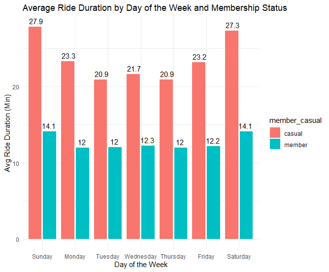

## Introduction:

This project focuses on understanding the usage patterns of Cyclistic’s casual riders and annual members. The analysis follows the structured process taught in the Google Data Analytics course, which includes the six steps: Ask, Prepare, Process, Analyze, Share, and Act. The deliverables will guide Cyclistic in creating data-driven marketing strategies aimed at converting casual riders into annual members.

Multiple tools and techniques are used throughout the project to showcase various data analytics skills, although the focus remains on efficiently identifying insights to support Cyclistic’s business objectives.

**Data Analysis Process**
  - Ask: Identify the problem or question to solve.
  - Prepare: Collect and organize the necessary data.
  - Process: Clean and transform the data for analysis.
  - Analyze: Explore the data to find insights and patterns.
  - Share: Present your findings with clear visuals and recommendations.
  - Act: Provide actionable steps based on the analysis.

## Step 1: Ask

**Project Background:**

Cyclistic, a Chicago-based bike-share program, operates a fleet of over 5,800 bikes at 692 docking stations. It offers traditional two-wheeled bikes as well as specialized assistive bikes, which make it inclusive for individuals with disabilities. While the majority of users (about 92%) prefer standard bikes, 8% utilize assistive bikes. Cyclistic serves both leisure riders and commuters, with about 30% of its riders using the service for daily commutes.

Cyclistic offers three pricing plans: single-ride passes, full-day passes, and annual memberships. Casual riders, who typically use single-ride or day passes, are familiar with the service but are less likely to become annual members. Annual members, on the other hand, are more profitable and represent a more stable revenue source for Cyclistic.

**Business Problem:**

Cyclistic's future growth depends on increasing the number of annual members. While casual riders bring awareness to the service, converting these riders into annual members has become a priority for the marketing team. Lily Moreno, the director of marketing, believes that understanding the behavioral differences between casual riders and annual members will allow the team to design effective strategies for this conversion.

The key business question for this analysis is: **How do casual riders and annual members use Cyclistic bikes differently?**

This insight is critical because it will inform marketing strategies aimed at encouraging casual riders to switch to annual memberships.

**Goals:**

The immediate goal is to answer the core question: **How do casual riders and annual members use Cyclistic bikes differently?** This understanding will set the stage for addressing the broader questions:
1. Why would casual riders want to purchase annual memberships?
2. How can Cyclistic leverage digital media to influence casual riders to become annual members?
   
These insights will help design targeted marketing strategies to convert casual riders, driving revenue growth and improving long-term sustainability.

**Stakeholders:**

- **Lily Moreno:** Director of Marketing, responsible for guiding the marketing strategy and ensuring it aligns with the company’s goals.
- **Cyclistic Marketing Analytics Team:** The team of data analysts tasked with collecting, analyzing, and reporting data to support the marketing strategy.
- **Cyclistic Executive Team:** The decision-makers who will review and approve the recommended marketing strategies based on data insights.
- **Casual Riders and Annual Members:** The two key user groups whose behaviors and preferences will be analyzed to guide the marketing efforts.

## Step 2: Prepare

**Data Sources:**

This analysis uses Cyclistic’s historical trip data, covering the past 12 months of bike rides. The data was provided by Motivate International Inc. and is publicly available and licensed for use in this case study. While Cyclistic is fictional, the data is structured to allow analysis of bike usage without any real-world privacy concerns. The data has been anonymized and does not include any personally identifiable information (PII).

**Data Collection:**

The trip data is sourced from Cyclistic’s bike-sharing system, which tracks all rides taken activity within the service area. The dataset includes details such as ride start and end times, bike type, user type (casual rider or annual member), and the station locations. This data is stored in a series of (.csv) files, each representing one month of ride activity from October 2023 to September 2024. 

**Data Description:**

The dataset is split into twelve (.csv) files, one for each month from October 2023 to September 2024. Each file includes several key variables related to individual rides:

| No. | Name | Description |
|-----|------|-------------|
| 01  | ride_id | Unique identifier for each ride. |
| 02  | rideable_type | Type of bike used for the ride. |
| 03  | started_at | Timestamp indicating when the ride began. |
| 04  | ended_at | Timestamp indicating when the ride ended. |
| 05  | start_station_name | Name of the starting station. |
| 06  | start_station_id | ID of the starting station. |
| 07  | end_station_name | Name of the ending station. |
| 08  | end_station_id | ID of the ending station. |
| 09  | start_lat | Latitude of the starting location. |
| 10  | start_lng | Longitude of the starting location. |
| 11  | end_lat | Latitude of the ending location. |
| 12  | end_lng | Longitude of the ending location. |
| 13  | member_casual | Indicates whether the rider is a casual user or an annual member. |

This data provides a comprehensive look at user behavior and bike-sharing patterns, allowing us to answer key business questions regarding how different types of riders use Cyclistic’s bikes.

**Addressing Privacy and Accessibility:**

The data is publicly available and fully compliant with privacy standards. It does not contain any personally identifiable information (such as credit card numbers or addresses), ensuring the data is safe to use for analysis. The data is available in (.csv) format, which facilitates easy import and analysis using various tools such as R, SQL, and Tableau.

**How the Data Helps Answer Our Questions:**

This dataset is critical for answering the business question of how annual members and casual riders use Cyclistic bikes differently. By analyzing variables like ride start and end times, bike types, and station usage, we can identify patterns in bike usage. For example, we can compare the frequency and duration of rides between casual riders and annual members, explore which stations are used most frequently by each group, and analyze trends in seasonal or time-of-day usage.

**Potential Data Issues:**

There are no significant issues with the dataset in terms of privacy or security, as it has been anonymized. However, potential challenges include the limitations on linking individual riders to specific demographic information (like location or purchase history), which could add more context to the analysis. Additionally, there may be occasional missing or incorrect entries in the dataset that will need to be cleaned before proceeding with detailed analysis.

## Step 3: Process

**Process Overview:**

In this phase, Cyclistic bike-share data is processed and cleaned following the steps outlined in the Project Charter. The goal is to ensure the data is ready for analysis, involving tasks such as cleaning, merging, and transforming. The main steps in the data processing phase include:
  1.	**Data Cleaning:** This involves resolving formatting issues, addressing null or missing values, removing duplicate records, and fixing any other inconsistencies that could affect data quality.
  2.	**Merging and Transforming:** Combining the 12 separate data files into a single dataset and transforming it into a format that is easy to analyze.
The Project Charter outlines three approaches for data processing and analysis: Excel, SQL, and R. While Excel is useful, it is less optimal for large datasets due to file size limitations. In real-world situations, SQL or R would be more appropriate for handling large-scale data. For this portfolio project, all three methods are demonstrated to showcase a variety of technical skills.

**Data Overview:**

The raw data consists of 12 files containing trip data collected from the Cyclistic bike-share program over the past 12 months. After an initial review and cleaning process, these files were merged into a single dataset, resulting in 5,854,585 rows and 13 columns of character and numeric data.

### Review and Processing Steps:

**Step 1: File Setup and Data Merging**

  -	Unzip the files.
  -	Store the twelve .csv files in a dedicated folder to manage the raw data.
  -	Review the 12 original files and merge them into a single consolidated dataset.

**Step 2: Data Cleaning**

**The following quality checks were performed to ensure the integrity of the data:**

  1.	**Column Name Consistency:** Ensured that column names across all 12 files adhered to consistent naming conventions. Any discrepancies were standardized to maintain uniformity.
  2.	**Data Type Consistency:** Verified that the correct and consistent data types were applied across all relevant columns.
  3.	**Duplicate Records:** Identified and removed duplicate entries where trips were repeated within the dataset.
  4.	**Missing or Null Values:** Detected missing or null values in key columns (e.g., ride start time, ride end time) and removed rows with critical missing information.
  5.	**Inconsistent Data:** Checked for data inconsistencies, such as instances where the ride start time was later than the ride end time. These anomalies were addressed through removal or correction where feasible.

**Step 3: Data Transformation**

To prepare the dataset for analysis, several transformations were applied:

1.	**Creating a ‘Ride Length’ Column:**
    -	**Description:**
    
        A new column was created to calculate the length of each ride by subtracting the started_at timestamp from the ended_at timestamp. This calculation yields the total duration of the ride in minutes.
 
    -	**Formula:**
    
        ride_length = ended_at - started_at
   	
    -	**Tool-Specific Notes:**
    
        - **Excel:** =D2-C2 (Where C2 is the ride start time and D2 is the ride end time).
        - **SQL:** TIMESTAMPDIFF(MINUTE, started_at, ended_at) (Calculates ride duration in minutes).
        - **R:** difftime(ended_at, started_at, units = "mins") (Calculates ride duration in minutes).

2.	**Creating a ‘Day of Week’ Column:**
    -	**Description:**

        A new column was created to capture the day of the week for each ride, enabling the analysis of patterns based on weekday versus weekend usage.

  	- **Tool-Specific Notes:**

        - **Excel:** =WEEKDAY(C2, 1) (Returns a number from 1 (Sunday) to 7 (Saturday)).
        - **SQL:** DAYOFWEEK(started_at) (Returns the day of the week as a number).
        - **R:** wday(started_at, label = TRUE) (Returns the day of the week as a label, e.g., “Mon”, “Tue”, etc.).

### Tool-Specific Approaches

**Excel Approach**

While Excel is a widely-used tool for data analysis, it is not well-suited for handling very large datasets due to its memory limitations. Excel can accommodate up to 1,048,575 rows per worksheet, which may restrict its use for large-scale analysis. For this project, the following steps were performed using Excel:

Step 1: File Setup and Data Merging:

The 12 .csv files were merged into one workbook using Power Query. New columns were created to separate the started_at and ended_at timestamps into started_at_date, started_at_time, ended_at_date, and ended_at_time for better manipulation. However, an error was encountered due to Excel's row limit, which is insufficient for the dataset size. The data exceeded the 1,048,575-row limit per sheet, rendering this method impractical for the full dataset.


Step 2: Data Cleaning:

The “Remove Duplicates” function was applied to identify and remove any duplicate records. No duplicates were detected within the subset of data that Excel could process.
      
Step 3: Data Transformation: 
  
Formulas were applied to calculate key metrics:

  - Ride length: =I2 - F2 (Where F2 is the ride start time and I2 is the ride end time).
  - Day of week: =WEEKDAY(C2, 1) (Returns the day of the week based on the start time).


> Note: Due to the large size of the dataset (5,854,585 rows), Excel was unable to fully handle the data. While Excel can be useful for small to medium-sized datasets, SQL and R are better suited for managing large datasets of this scale.

> Note: If Excel is the only available tool for this analysis, it is possible to work with each of the 12 files individually and then aggregate the data into a single sheet for analysis. While this approach is feasible, it would be significantly more time-consuming and less efficient compared to using a database or scripting language like SQL or R. Nonetheless, it remains a viable option if other tools are unavailable.

**SQL Approach**

While SQL is a powerful and efficient tool for managing large datasets, it is well-suited for structured data analysis on databases. The following steps were performed using PostgreSQL to ensure the dataset was ready for in-depth analysis:

Step 1: File Setup and Data Merging:

The 12 .csv files were imported into the public.bike_trips table using PostgreSQL's COPY command. 
  - Create table to store dataset: A new table named bike_trips was created in PostgreSQL to hold the dataset. The table structure was defined with appropriate data types for each column, ensuring compatibility with the data in the .csv files.
  - Importing the .csv files: PostgreSQL’s COPY command was used to import the CSV files directly into the bike_rides table. 

Step 2: Data Cleaning: 

Data cleaning is crucial to ensure the dataset is accurate and suitable for analysis. Several steps were implemented to clean the data:

  - Removing duplicates: Duplicate records were identified and removed based on the ride_id using PostgreSQL’s ROW_NUMBER() function. This ensured that each ride had only one unique entry.
  - Removing rows with NULL values: Rows with NULL values in critical columns (e.g., started_at, ended_at, start_station_name, end_station_name) were removed to prevent incomplete or inaccurate data from skewing the analysis.
  - Removing outliers: Outliers based on ride_length were identified and removed. Specifically, records where the ride duration was less than 1 minute or greater than 24 hours were filtered out.

Step 3: Data Transformation:

To prepare the dataset for analysis, several transformations were applied to create new columns and extract relevant features:
  - Creating a new column for ride duration: A new column, ride_length, was created to calculate the duration of each ride in minutes. The duration was calculated as the difference between the ended_at and started_at timestamps.
  - Extracting the day of the week: A new column, day_of_week, was added to extract the day of the week from the started_at timestamp. The days of the week were represented as integers, where 1 = Sunday and 7 = Saturday.

SQL QUERIES: 

```

/*
PREPARE DATA
*/

-- Create primary table to store cyclistic bike trip data. 

CREATE TABLE IF NOT EXISTS public.bike_trips (
	ride_id	VARCHAR(50),			-- Unique identifier for each ride. 
	rideable_type VARCHAR(20),		-- Type of bike used for the ride. 
	started_at TIMESTAMP,			-- Timestamp indicating when the ride began. 
	ended_at TIMESTAMP,			-- Timestamp indicating when the ride ended. 
	start_station_name VARCHAR(100),	-- Name of the starting station. 
	start_station_id VARCHAR(50),		-- ID of the starting station. 
	end_station_name VARCHAR(100),		-- Name of the ending station. 
	end_station_id VARCHAR(50),		-- ID of the ending station. 
	start_lat FLOAT,			-- Latitude of the starting location. 
	start_lng FLOAT,			-- Longitude of the starting location. 
	end_lat	FLOAT,				-- Latitude of the ending location. 
	end_lng FLOAT,				-- Longitude of the ending location. 
	member_casual VARCHAR(10)		-- Indicates whether the rider is a casual user or an annual member. 
);

-- Import data from the 12 .csv files into the `public.bike_trips` table.

COPY public.bike_trips (ride_id,rideable_type,started_at,ended_at,start_station_name,start_station_id,end_station_name,end_station_id,start_lat,start_lng,end_lat,end_lng,member_casual) FROM '\202310-divvy-tripdata.csv' DELIMITER ',' CSV header;
COPY public.bike_trips (ride_id,rideable_type,started_at,ended_at,start_station_name,start_station_id,end_station_name,end_station_id,start_lat,start_lng,end_lat,end_lng,member_casual) FROM '\202311-divvy-tripdata.csv' DELIMITER ',' CSV header;
COPY public.bike_trips (ride_id,rideable_type,started_at,ended_at,start_station_name,start_station_id,end_station_name,end_station_id,start_lat,start_lng,end_lat,end_lng,member_casual) FROM '\202312-divvy-tripdata.csv' DELIMITER ',' CSV header;
COPY public.bike_trips (ride_id,rideable_type,started_at,ended_at,start_station_name,start_station_id,end_station_name,end_station_id,start_lat,start_lng,end_lat,end_lng,member_casual) FROM '\202401-divvy-tripdata.csv' DELIMITER ',' CSV header;
COPY public.bike_trips (ride_id,rideable_type,started_at,ended_at,start_station_name,start_station_id,end_station_name,end_station_id,start_lat,start_lng,end_lat,end_lng,member_casual) FROM '\202402-divvy-tripdata.csv' DELIMITER ',' CSV header;
COPY public.bike_trips (ride_id,rideable_type,started_at,ended_at,start_station_name,start_station_id,end_station_name,end_station_id,start_lat,start_lng,end_lat,end_lng,member_casual) FROM '\202403-divvy-tripdata.csv' DELIMITER ',' CSV header;
COPY public.bike_trips (ride_id,rideable_type,started_at,ended_at,start_station_name,start_station_id,end_station_name,end_station_id,start_lat,start_lng,end_lat,end_lng,member_casual) FROM '\202404-divvy-tripdata.csv' DELIMITER ',' CSV header;
COPY public.bike_trips (ride_id,rideable_type,started_at,ended_at,start_station_name,start_station_id,end_station_name,end_station_id,start_lat,start_lng,end_lat,end_lng,member_casual) FROM '\202405-divvy-tripdata.csv' DELIMITER ',' CSV header;
COPY public.bike_trips (ride_id,rideable_type,started_at,ended_at,start_station_name,start_station_id,end_station_name,end_station_id,start_lat,start_lng,end_lat,end_lng,member_casual) FROM '\202406-divvy-tripdata.csv' DELIMITER ',' CSV header;
COPY public.bike_trips (ride_id,rideable_type,started_at,ended_at,start_station_name,start_station_id,end_station_name,end_station_id,start_lat,start_lng,end_lat,end_lng,member_casual) FROM '\202407-divvy-tripdata.csv' DELIMITER ',' CSV header;
COPY public.bike_trips (ride_id,rideable_type,started_at,ended_at,start_station_name,start_station_id,end_station_name,end_station_id,start_lat,start_lng,end_lat,end_lng,member_casual) FROM '\202408-divvy-tripdata.csv' DELIMITER ',' CSV header;
COPY public.bike_trips (ride_id,rideable_type,started_at,ended_at,start_station_name,start_station_id,end_station_name,end_station_id,start_lat,start_lng,end_lat,end_lng,member_casual) FROM '\202409-divvy-tripdata.csv' DELIMITER ',' CSV header;


-- Calculate the total row count, count of unique ride_id's, and the number of duplicate records.
-- Output: 5,854,544 rows, 5,854,333 distinct rows, 211 duplicate rows.

SELECT COUNT(*) AS count,
	COUNT(DISTINCT ride_id) AS distinct_count,
	COUNT(*) - COUNT(DISTINCT ride_id) AS duplicate_count
FROM public.bike_trips;

-- Identify and delete duplicate records based on ride_id. 
-- Delete 211 duplicate rows.

WITH ranked_bike_trips AS (
    SELECT ctid, 
           ROW_NUMBER() OVER (PARTITION BY ride_id) AS rn
    FROM public.bike_trips
)
DELETE FROM public.bike_trips
WHERE ctid IN (
    SELECT ctid
    FROM ranked_bike_trips
    WHERE rn > 1
);

-- Identify and delete rows with NULL values in key columns. 
-- Delete 1,626,238 null rows.

DELETE FROM public.bike_trips
WHERE started_at IS NULL
   OR ended_at IS NULL
   OR start_station_name IS NULL
   OR end_station_name IS NULL;

-- Identify and delete outliers based on ride_length.
-- Delete 50,330 outliers.

DELETE FROM public.bike_trips
WHERE EXTRACT(EPOCH FROM (ended_at - started_at)) / 60 < 1 	-- duration < 1 minute
   OR EXTRACT(EPOCH FROM (ended_at - started_at)) / 60 > 1440 	-- duration > 1440 minutes (24 hours)


/*
Process Data
*/

-- Create new column ride_length to store the duration of each bike ride in minutes.

ALTER TABLE public.bike_trips
ADD ride_length INT;

-- Update the ride_length column by calculating the difference between ended_at and started_at in minutes.

UPDATE public.bike_trips
SET ride_length = EXTRACT(EPOCH FROM (ended_at - started_at)) / 60;

-- Create new column day_of_week to extract the day of the week from the started_at column.

ALTER TABLE public.bike_trips
ADD day_of_week INT;

-- Update the day_of_week column by extracting the day of the week from started_at. (NOTE: 1 = Sunday and 7 = Saturday).

UPDATE public.bike_trips
SET day_of_week = EXTRACT(DOW FROM started_at) + 1;

```

**R Approach**

R is a powerful tool for statistical computing and data manipulation, particularly well-suited for handling large datasets like this one. The steps below outline the data processing workflow in R.

Step 1: File Setup and Data Merging:

The 12 .csv files were imported into R and merged into a single unified data frame using functions from the tidyverse package. 
  - Install necessary packages: Installed dyplyr, lubridate, ggplot2, and tidyverse packages.
  - Importing the .csv files: The readr::read_csv() function from the tidyverse package was used to read the CSV files into R.
  - Merging the datasets: To combine the multiple data frames into one, the dplyr::bind_rows() function was used. This function efficiently appends multiple data frames into a single data frame, maintaining row consistency across files. 

Step 2: Data Cleaning:

To ensure the dataset was clean and reliable for analysis, several data cleaning steps were performed using dplyr and base R functions:
  - Removing duplicates: Duplicate records were identified by checking for duplicate ride_id values. The dplyr::distinct() function was used to keep only unique rows, ensuring each ride had a single entry.
  - Removing rows with NULL values: Rows with missing values in critical columns (such as started_at, ended_at, start_station_name, or end_station_name) were filtered out to prevent incomplete records from affecting the analysis. This was done using the dplyr::filter() function.
  - Removing outliers: Outliers in ride duration were identified and filtered out. Rides with a duration of less than 1 minute or greater than 24 hours were considered outliers and excluded using conditions in the filter() function.

Step 3: Data Transformation: 

Several key transformations were performed to prepare the data for analysis:
  - Creating a new column for ride duration: A new column, ride_length, was created to calculate the duration of each ride in minutes. The difftime() function was used to compute the difference between the ended_at and started_at timestamps.
  - Extracting the day of the week: A new column, day_of_week, was created to extract the day of the week from the started_at timestamp. The day was represented as an integer, where 1 = Sunday and 7 = Saturday, using the weekdays() function and additional manipulation.

R CODE:

```
#
#  PREPARE DATA
#
  

## Install necessary packages and libraries

install.packages("dplyr")
install.packages("lubridate")
install.packages("tidyverse")

library(dplyr)
library(lubridate)
library(ggplot2)
library(readr)
library(scales)
library(tidyverse)

# Set the directory where .csv files are stored

csv_directory <- "C:/Users/dark_/Downloads/Google Data Analytics Certificiate/Case Study 1/raw_data/"

# List all .csv files in the directory

csv_files <- list.files(path = csv_directory, pattern = "*.csv", full.names = TRUE)

# Read and merge all .csv files into a single data frame using bind_rows

bike_trips <- csv_files %>%
  lapply(read_csv) %>%
  bind_rows()

# Calculate the total row count, count of unique ride_id's, and the number of duplicate records.
# Output: 5,854,544 rows, 5,854,333 distinct rows, 211 duplicate rows.

total_count <- nrow(bike_trips)                       # Calculate total row count
unique_ride_ids <- n_distinct(bike_trips$ride_id)     # Calculate count of unique ride_id's
duplicate_count <- total_count - unique_ride_ids      # Calculate the number of duplicate records

cat("Total Row Count:", total_count, "\n")
cat("Unique Ride IDs:", unique_ride_ids, "\n")
cat("Duplicate Records:", duplicate_count, "\n")


# Identify and delete duplicate records based on ride_id. 
# Delete 211 duplicate rows.

bike_trips_cleaned <- bike_trips %>%
  distinct(ride_id, .keep_all = TRUE)

# Identify and delete rows with NULL values in key columns. 
# Delete 1,626,238 null rows. 

bike_trips_cleaned <- bike_trips_cleaned %>%
  filter(!is.na(started_at), !is.na(ended_at), !is.na(start_station_name), !is.na(end_station_name))

# Identify and delete outliers based on duration.
# Delete 50,330 outliers.

bike_trips_cleaned <- bike_trips_cleaned %>%
  filter(difftime(ended_at, started_at, units = "mins") >= 1 &         # duration < 1 minute
         difftime(ended_at, started_at, units = "mins") <= 1440)       # duration > 1440 minutes (24 hours)


#
# Process Data
#


# Create new column ride_length to store the duration of each bike ride in minutes.
# Update the ride_length column by calculating the difference between ended_at and started_at in minutes.

bike_trips_cleaned <- bike_trips_cleaned %>%
  mutate(ride_length = as.numeric(difftime(ended_at, started_at, units = "mins")))

# Create new column day_of_week to extract the day of the week from the started_at column.
# Update the day_of_week column by extracting the day of the week from started_at. (NOTE: 1 = Sunday and 7 = Saturday).

bike_trips_cleaned <- bike_trips_cleaned %>%
  mutate(day_of_week = as.integer(format(started_at, "%w")) + 1)

```


## Step 4: Analyze

**Data Analysis Summary:**

The analysis of the bike trips data was conducted using a PostgreSQL database, focusing on various key metrics related to ride lengths and usage patterns. The steps undertaken in the analysis involved calculating aggregate statistics such as the mean, median, and mode of ride lengths, as well as other insightful aggregations related to membership types, days of the week, ride start times, stations, and bike types.

**Key Findings from Data Analysis:**

1. Mean, Median, and Mode of Ride Length:
    - The average ride length was approximately 16.68 minutes.
    - The median ride length, which represented the middle point of the dataset, was 10 minutes.
    - The mode of ride length, which indicates the most frequent ride duration, was 5 minutes. This suggests that the majority of rides are relatively short in duration.
2. Mode of Day of the Week:
    - The most common day of the week for bike trips was identified through the mode of the day_of_week column.
    - The result showed that Wednesday (day 4) had the most trips, meaning it was the most popular day for riding bikes in the dataset.
3. Average Ride Length by Membership Type:
    - The dataset was grouped by member_casual to calculate the average ride length based on membership type.
    - The average ride length for casual riders was calculated at 24.14 minutes, while for members it was 12.56 minutes. This indicates that casual riders tend to ride significantly longer than members on average.
4. Average Ride Length by Day of the Week and Membership Type:
    - The average ride length was analyzed further by grouping the data by both day_of_week and member_casual.
    - This helped identify patterns in ride lengths across different days and membership statuses. 
5. Ride Count by Day of the Week:
    - The total number of rides per day of the week was calculated.
    - This information helps understand the daily distribution of bike trips, which can be useful for operational decisions, such as resource allocation and station management.
6. Ride Count and Average Ride Length by Hour of the Day:
    - A detailed breakdown was done by hour of the day to calculate both the total ride count and average ride length.
    - This analysis revealed peak usage hours for bike rides and the associated average ride lengths, providing insights into ride demand patterns throughout the day.
7. Average Ride Length by Starting Station:
    - The average ride length was calculated by starting station name.
    - This helps identify which stations have longer or shorter average rides, which could indicate station-specific factors such as location, destination proximity, or user preferences.
8. Most Common Start and End Station Pairs:
    - The most frequent station-to-station routes were identified by grouping the data by both start_station_name and end_station_name.
    - This provided insight into the most popular travel routes and can be useful for understanding biking behavior and optimizing station placement.
9. Average Ride Length by Bike Type:
    - The analysis also included a breakdown of the average ride length by rideable_type, showing how different bike types were utilized.
    - This helps to identify trends in the usage of various bike types, which could be useful for fleet management and operational improvements.

**EXCEL APPROACH:**


**SQL QUERIES:**

```
/*
Analyze Data
*/

-- Calculate the mean, median, and mode of the ride_length column in minutes. 
-- Output: Mean - 16.68, Median - 10, Mode - 5.

SELECT 
    AVG(ride_length) AS mean_ride_length,
    PERCENTILE_CONT(0.5) WITHIN GROUP (ORDER BY ride_length) AS median_ride_length,
    MODE() WITHIN GROUP (ORDER BY ride_length) AS mode_ride_length
FROM 
    public.bike_trips;

-- Calculate the mode of the day_of_week column. (NOTE: 1 = Sunday and 7 = Saturday).
-- Output: Mode - 4 (Wednesday)

SELECT 
    MODE() WITHIN GROUP (ORDER BY day_of_week) AS mode_day_of_week
FROM 
    public.bike_trips;

-- Calculate the average ride_length by member_casual. 
-- Output: casual - 24.14, member - 12.56

SELECT 
    member_casual,
    AVG(ride_length) AS avg_ride_length
FROM 
    public.bike_trips
GROUP BY 
    member_casual
ORDER BY 
    member_casual;

-- Calculate the average ride_length by day_of_week and member_casual. 
-- Output: Average ride length grouped by both day of the week and membership status. 

SELECT 
    day_of_week,
    member_casual,
    AVG(ride_length) AS avg_ride_length
FROM 
    public.bike_trips
GROUP BY 
    day_of_week, member_casual
ORDER BY 
    day_of_week, member_casual;

-- Calculate the number of ride_id per day_of_week.
-- Output: Total ride count for each day of the week.

SELECT 
    day_of_week,
    COUNT(ride_id) AS ride_count
FROM 
    public.bike_trips
GROUP BY 
    day_of_week
ORDER BY 
    day_of_week;

-- Calculate the number of ride_id and average ride_length by hour of the day.
-- Output: Ride count and average ride length for each hour.

SELECT 
    EXTRACT(HOUR FROM started_at) AS hour_of_day, 
    COUNT(ride_id) AS ride_count,
    AVG(ride_length) AS avg_ride_length
FROM 
    public.bike_trips
GROUP BY 
    hour_of_day
ORDER BY 
    hour_of_day;

-- Calculate the average ride_length by starting_station_name.
-- Output: Average ride length for each station. 

SELECT 
    start_station_name,
    AVG(ride_length) AS avg_ride_length
FROM 
    public.bike_trips
GROUP BY 
    start_station_name
ORDER BY 
    avg_ride_length DESC;

-- Determine the most common start and end station pairs. 
-- Output: The most frequently used station-to-station routes.

SELECT 
    start_station_name, 
    end_station_name, 
    COUNT(ride_id) AS ride_count
FROM 
    public.bike_trips
GROUP BY 
    start_station_name, end_station_name
ORDER BY 
    ride_count DESC;

-- Calculate the average ride_length by rideable_type.
-- Output: Average ride length for different bike types.

SELECT 
    rideable_type, 
    AVG(ride_length) AS avg_ride_length
FROM 
    public.bike_trips
GROUP BY 
    rideable_type;

```

**R CODE:**

```
#
# Analyze Data
#

# Calculate the mean, median, and mode of the ride_length column in minutes. 
# Output: Mean - 16.68, Median - 10, Mode - 5.

get_mode <- function(x) {                        # Function to calculate the Mode
  uniq_x <- unique(x)                            # Get unique values
  uniq_x[which.max(tabulate(match(x, uniq_x)))]  # Return the most frequent value
}

mean_ride_length <- mean(bike_trips_cleaned$ride_length, na.rm = TRUE)     # Calculate the Mean
median_ride_length <- median(bike_trips_cleaned$ride_length, na.rm = TRUE) # Calculate the Median
mode_ride_length <- get_mode(bike_trips_cleaned$ride_length)               # Calculate the Mode

cat("Mean ride length: ", mean_ride_length, "\n")
cat("Median ride length: ", median_ride_length, "\n")
cat("Mode ride length: ", mode_ride_length, "\n")

# Calculate the mode of the day_of_week column. (NOTE: 1 = Sunday and 7 = Saturday).
# Output: Mode - 4 (Wednesday)

mode_day_of_week <- get_mode(bike_trips_cleaned$day_of_week)              # Calculate the Mode

cat("Mode of day_of_week: ", mode_day_of_week, "\n")

# Count of rides among member and casual users: 
# Output: casual -  1,486,827 - 35.59%, member - 2,690,938 - 64.41%

ride_distribution <- bike_trips_cleaned %>%
  group_by(member_casual) %>%
  summarize(n=n()) %>%
  mutate(percentage = n*100/sum(n))

view(ride_distribution)

# Calculate the average ride_length by member_casual. 
# Output: casual - 24.14, member - 12.56

# Calculate the average ride_length by member_casual

avg_ride_length_by_member_casual <- bike_trips_cleaned %>%
  group_by(member_casual) %>%
  summarise(avg_ride_length = mean(ride_length, na.rm = TRUE))

view(avg_ride_length_by_member_casual)

# Calculate the average ride_length by day_of_week and member_casual. 
# Output: Average ride length grouped by both day of the week and membership status. 

avg_ride_length_by_day_and_member <- bike_trips_cleaned %>%
  group_by(day_of_week, member_casual) %>%
  summarise(avg_ride_length = mean(ride_length, na.rm = TRUE))

view(avg_ride_length_by_day_and_member)

# Calculate the number of ride_id by day_of_week and member_casual.
# Output: Total ride count grouped by both day of the week and membership status.

ride_count_by_day_and_member <- bike_trips_cleaned %>%
  group_by(day_of_week, member_casual) %>%
  summarise(ride_count = n())

view(ride_count_by_day_and_member)

# Calculate the number of ride_id and average ride_length by hour of the day.
# Output: Ride count and average ride length for each hour.

ride_summary_by_hour <- bike_trips_cleaned %>%
  mutate(hour_of_day = hour(started_at)) %>%
  group_by(hour_of_day) %>%
  summarise(ride_count = n(), avg_ride_length = mean(ride_length, na.rm = TRUE)) %>%
  arrange(hour_of_day)

view(ride_summary_by_hour)

# Calculate the average ride_length by starting_station_name.
# Output: Average ride length for each station. 

avg_ride_length_by_station <- bike_trips_cleaned %>%
  group_by(start_station_name) %>%
  summarise(avg_ride_length = mean(ride_length, na.rm = TRUE)) %>%
  arrange(desc(avg_ride_length))  

view(avg_ride_length_by_station)

# Determine the most common start and end station pairs. 
# Output: The most frequently used station-to-station routes.

common_station_pairs <- bike_trips_cleaned %>%
  group_by(start_station_name, end_station_name) %>%
  summarise(ride_count = n()) %>%
  arrange(desc(ride_count))

view(common_station_pairs)

# Calculate the average ride_length by rideable_type.
# Output: Average ride length for different bike types.

avg_ride_length_by_type <- bike_trips_cleaned %>%
  group_by(rideable_type) %>%
  summarise(avg_ride_length = mean(ride_length, na.rm = TRUE))

view(avg_ride_length_by_type)

# Compare rideable_type by member_casual.
# Output: Count and Percentage of rides by bike type and member type.

rideable_by_member <- bike_trips_cleaned %>%
  group_by(member_casual, rideable_type) %>%
  summarize(n=n()) %>%
  mutate(percentage = n*100/sum(n))

view(rideable_by_member)

```

## Step 5: Share

**Data Visualization and Findings Summary:**

In this phase, the focus shifts to presenting the key findings from our analysis through polished, accessible, and insightful visualizations. The goal is to clearly communicate how annual members and casual riders use Cyclistic bikes differently and provide actionable insights for decision-making.

Tableau will serve as the primary tool for sharing these insights, allowing us to build an interactive, visually appealing dashboard that effectively conveys the data. The dashboard will emphasize clarity, conciseness, and actionability to help the executive team understand user behavior patterns. This understanding is crucial for making more targeted decisions related to marketing, bike availability, and user engagement.
Key visualizations will include:

1.	A comparison of average ride length between annual members and casual riders.
2.	A breakdown of ride usage by day of the week and time of day.
3.	Insights into the most frequent start and end station pairs and bike types used.
4.	A clear view of how ride behaviors differ between membership status and time-specific trends.
   
By utilizing Tableau’s interactive capabilities, the dashboard will not only highlight key trends but also allow stakeholders to drill down into the details, making the data accessible and actionable for the entire executive team.

The goal is to ensure that the findings are both engaging and easy to digest, ensuring everyone in the room can grasp the implications of the data and use it to inform future strategy for Cyclistic. This dashboard will serve as a powerful tool for guiding decisions that align with the company’s goals of increasing ridership and optimizing the user experience.

> NOTE: Methods used in Excel and R for visualizing the dataset are also included, demonstrating the analytical capabilities of these tools.

TABLEAU: (LINK TO PUBLIC TABLEAU DASHBOARD)


EXCEL APPROACH: 


R CODE:
```
#
# Share Data
#

# Visualize: Count of rides among member and casual users

ggplot(data = executive_summ, mapping = aes(x = member_casual, y = n, fill = member_casual)) +
  geom_bar(stat = "identity") +  
  labs(title = "User Count: Casual vs Member", x = "Membership Status", y = "Count of Rides") +
  scale_y_continuous(labels = scales::comma) +                                                
  geom_text(aes(label = paste0(n, " (", round(percentage, 2), "%)")), vjust = -0.3, size = 4, color = "black") +
  theme_minimal()

# Visualize: average ride_length by member_casual

ggplot(data = avg_ride_length_by_member_casual, mapping = aes(x=member_casual, y = avg_ride_length, fill=member_casual)) +
  geom_col() + 
  labs(title="Ride Trip Duration: Casual vs Member", x = "Membership Status", y = "Avg Ride Duration (Min)") +
  geom_text(aes(label = paste0(round(avg_ride_length, 2), " min")), vjust = -0.3, size = 4, color = "black") +
  theme_minimal()

# Visualize: Avg ride duration by day of the week member type.

ggplot(data = avg_ride_length_by_day_and_member, mapping = aes(x = as.factor(day_of_week), y=avg_ride_length, fill = member_casual)) + 
  geom_col(position = "dodge2") + 
  labs(title = "Average Ride Duration by Day of the Week and Membership Status", x = "Day of the Week", y = "Avg Ride Duration (Min)") +
  geom_text(aes(label = round(avg_ride_length, 1)), position = position_dodge2(width = 0.8), vjust = -0.5, size = 4, color = "black") +
  scale_x_discrete(labels = c("1" = "Sunday", "2" = "Monday", "3" = "Tuesday", "4" = "Wednesday", "5" = "Thursday", "6" = "Friday", "7" = "Saturday")) + 
  theme_minimal()

# Visualize: Number of rides by day of the week and membership status. 

ggplot(data = ride_count_by_day_and_member, mapping = aes(x = as.factor(day_of_week), y=ride_count, fill = member_casual)) + 
  geom_col(position = "dodge2") + 
  labs(title = "Number of Rides by Day of the Week and Membership Status", x = "Day of the Week", y = "Count of Rides") +
  geom_text(aes(label = round(ride_count, 1)), position = position_dodge2(width = 0.8), vjust = -0.5, size = 4, color = "black") +
  scale_y_continuous(labels = scales::comma) +                                                
  scale_x_discrete(labels = c("1" = "Sunday", "2" = "Monday", "3" = "Tuesday", "4" = "Wednesday", "5" = "Thursday", "6" = "Friday", "7" = "Saturday")) + 
  theme_minimal()

# Visualize: rideable_type by member_casual

ggplot(data = rideable_by_member, mapping = aes(x=member_casual, y=percentage, fill=rideable_type)) +
  geom_col() +
  labs(title = "Bike Types by Member Status", x = "Membership Status", y = "Percentage of Rides") +
  geom_text(aes(label = paste0(round(percentage, 2), "%")), position = position_stack(vjust = 0.5), size = 4, color = "black") + 
  theme_minimal()

```
**R VISUALIZATIONS:**





## Step 6: Act


Now that you have finished creating your visualizations, act on your findings. Prepare the
deliverables Morena asked you to create, including the three top recommendations based on
your analysis. Use the following Case Study Roadmap as a guide:
Case Study Roadmap - Act
Guiding questions
● What is your final conclusion based on your analysis?
● How could your team and business apply your insights?
● What next steps would you or your stakeholders take based on your findings?
● Is there additional data you could use to expand on your findings?
Key tasks
● Create your portfolio.
● Add your case study.
● Practice presenting your case study to a friend or family member.
Deliverable ● Your top three recommendations based on your analysis
Follow these steps:
1. If you do not have one already, create an online portfolio.
2. Consider how you want to feature your case study in your portfolio.
3. Upload or link your case study findings to your portfolio.
4. Write a brief paragraph describing the case study, your process, and your discoveries.
5. Add the paragraph to introduce your case study in your portfolio.
