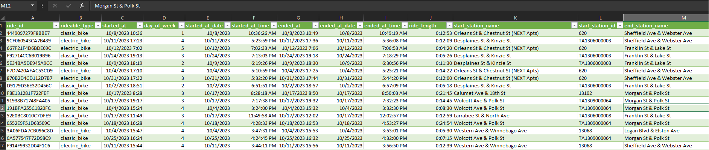

## Introduction:

This project focuses on understanding the usage patterns of Cyclistic’s casual riders and annual members. The analysis follows the structured process taught in the Google Data Analytics course, which includes the six steps: Ask, Prepare, Process, Analyze, Share, and Act. The deliverables will guide Cyclistic in creating data-driven marketing strategies aimed at converting casual riders into annual members.

Multiple tools and techniques are used throughout the project to showcase various data analytics skills, although the focus remains on efficiently identifying insights to support Cyclistic’s business objectives.

**Data Analysis Process**
  - Ask: Identify the problem or question to solve.
  - Prepare: Collect and organize the necessary data.
  - Process: Clean and transform the data for analysis.
  - Analyze: Explore the data to find insights and patterns.
  - Share: Present your findings with clear visuals and recommendations.
  - Act: Provide actionable steps based on the analysis.

## Step 1: Ask

**Project Background:**

Cyclistic, a Chicago-based bike-share program, operates a fleet of over 5,800 bikes at 692 docking stations. It offers traditional two-wheeled bikes as well as specialized assistive bikes, which make it inclusive for individuals with disabilities. While the majority of users (about 92%) prefer standard bikes, 8% utilize assistive bikes. Cyclistic serves both leisure riders and commuters, with about 30% of its riders using the service for daily commutes.

Cyclistic offers three pricing plans: single-ride passes, full-day passes, and annual memberships. Casual riders, who typically use single-ride or day passes, are familiar with the service but are less likely to become annual members. Annual members, on the other hand, are more profitable and represent a more stable revenue source for Cyclistic.

**Business Problem:**

Cyclistic's future growth depends on increasing the number of annual members. While casual riders bring awareness to the service, converting these riders into annual members has become a priority for the marketing team. Lily Moreno, the director of marketing, believes that understanding the behavioral differences between casual riders and annual members will allow the team to design effective strategies for this conversion.

The key business question for this analysis is: **How do casual riders and annual members use Cyclistic bikes differently?**

This insight is critical because it will inform marketing strategies aimed at encouraging casual riders to switch to annual memberships.

**Goals:**

The immediate goal is to answer the core question: **How do casual riders and annual members use Cyclistic bikes differently?** This understanding will set the stage for addressing the broader questions:
1. Why would casual riders want to purchase annual memberships?
2. How can Cyclistic leverage digital media to influence casual riders to become annual members?
   
These insights will help design targeted marketing strategies to convert casual riders, driving revenue growth and improving long-term sustainability.

**Stakeholders:**

- **Lily Moreno:** Director of Marketing, responsible for guiding the marketing strategy and ensuring it aligns with the company’s goals.
- **Cyclistic Marketing Analytics Team:** The team of data analysts tasked with collecting, analyzing, and reporting data to support the marketing strategy.
- **Cyclistic Executive Team:** The decision-makers who will review and approve the recommended marketing strategies based on data insights.
- **Casual Riders and Annual Members:** The two key user groups whose behaviors and preferences will be analyzed to guide the marketing efforts.

## Step 2: Prepare

**Data Sources:**

For this analysis, we utilize Cyclistic’s historical trip data spanning a 12-month period, provided by Motivate International Inc. under a public license. Although Cyclistic is a fictional company, the dataset closely mirrors real-world bike-share data, providing a reliable foundation for analysis. Crucially, the dataset is anonymized, ensuring compliance with privacy standards by excluding any personally identifiable information (PII), such as names or payment details.

**Data Collection:**

The dataset consists of 12 separate .csv files, each representing one month of ride data from October 2023 to September 2024. Each file includes details about the bike trips such as:
- Ride start and end times
- Bike types used (traditional or assistive)
- Starting and ending stations (with names, IDs, and geolocation data)
- The rider type (casual or member)
  
This monthly structure allows us to conduct time-based analyses, such as tracking seasonal trends or observing how bike usage varies by month, which will be critical in understanding user behavior over time.

**Data Description:**

The table below outlines the main variables included in the dataset:

| No. | Name | Description |
|-----|------|-------------|
| 01  | ride_id | Unique identifier for each ride. |
| 02  | rideable_type | Type of bike used for the ride. |
| 03  | started_at | Timestamp indicating when the ride began. |
| 04  | ended_at | Timestamp indicating when the ride ended. |
| 05  | start_station_name | Name of the starting station. |
| 06  | start_station_id | ID of the starting station. |
| 07  | end_station_name | Name of the ending station. |
| 08  | end_station_id | ID of the ending station. |
| 09  | start_lat | Latitude of the starting location. |
| 10  | start_lng | Longitude of the starting location. |
| 11  | end_lat | Latitude of the ending location. |
| 12  | end_lng | Longitude of the ending location. |
| 13  | member_casual | Indicates whether the rider is a casual user or an annual member. |

These variables provide all the necessary information for analyzing how users engage with Cyclistic’s bike-share program.

**Addressing Privacy and Accessibility:**

Since the data is publicly available and fully anonymized, privacy and security concerns are well managed. The exclusion of PII, such as names, credit card numbers, or home addresses, ensures compliance with privacy standards. Additionally, the data is accessible in .csv format, which is versatile and can easily be imported into tools like R, SQL, and Tableau for analysis.

**Data Integrity:**

Ensuring data integrity is essential for producing reliable insights. The following steps will be taken to verify and maintain the quality of the dataset:
- **Duplicate Data:** A check for duplicate entries will ensure that each ride is logged only once. Any duplicates found will be removed to prevent skewed results.
- **Missing Data:** Missing or incomplete entries, such as rides without end times or missing station names, will be identified. These records will either be cleaned or excluded from the analysis, depending on the extent and impact of the missing data.
- **Outliers:** Extreme values, such as unusually long or short trip durations, will be reviewed to determine if they represent legitimate data points or errors. Any unjustifiable outliers may be excluded to avoid distorting the analysis.
- **Data Types:** Each variable will be validated to ensure the correct data types are used. For instance, timestamps for start and end times will be checked for proper formatting, while latitude and longitude values will be confirmed as numeric data.
  
These steps will ensure that the dataset is clean, consistent, and reliable, enabling accurate insights and valid business conclusions.

**Data Credibility (ROCCC Framework):**

To assess the credibility of the data, we apply the ROCCC framework, focusing on:
- Reliable: The data is collected directly from Cyclistic’s tracking systems, ensuring accurate ride logs.
- Original: This is first-party data collected by Cyclistic itself, enhancing its authenticity.
- Comprehensive: The dataset covers all necessary variables for understanding user behavior, from trip start times to bike types.
- Current: The data spans the most recent 12 months, making it timely and relevant for strategic decisions.
- Cited: The data is licensed by Motivate International Inc.

**How the Data Answers the Business Question:**

The historical trip data is critical in answering the question: How do casual riders and annual members use Cyclistic bikes differently?

By analyzing variables like ride duration, start and end times, and station locations, we can uncover key behavioral differences between casual riders and annual members. For example:
- **Trip Duration:** Casual riders may take shorter or longer trips compared to annual members, which can provide insight into the purpose of their rides (e.g., leisure vs. commuting).
- **Time of Day/Week:** We can analyze usage patterns to see whether casual riders prefer weekends and holidays, while annual members might favor weekdays for commuting.
- **Station Popularity:** Comparing the starting and ending stations between the two groups may reveal preferences for certain areas, suggesting whether casual riders are more likely to use bikes for exploring the city, while annual members might use them for commuting.

**Potential Data Issues:**

While the dataset is comprehensive and anonymized, several limitations should be considered:
- **Limited Demographic Data:** The absence of demographic details such as age or gender restricts the ability to segment users based on these characteristics, which could provide additional context for rider behavior.
- **Occasional Missing Values:** As is common in large datasets, there may be instances of missing or incorrect data. These records will need to be addressed during the data cleaning process to ensure accuracy.
- **No Personal Linkage:** The lack of personal identifiers, such as credit card information or home addresses, prevents direct linkage of casual riders to specific locations or historical purchases. This limits the ability to analyze geographic proximity to docking stations or identify patterns in repeat usage.

Despite these limitations, the dataset remains robust and offers sufficient depth to generate valuable insights into the behavioral differences between casual and annual riders.

## Step 3: Process

**Overview:**

In this phase, the Cyclistic bike-share data is processed and cleaned in accordance with the guidelines outlined in the Project Charter. The objective is to ensure that the data is ready for analysis, encompassing tasks such as cleaning, merging, and transforming. The primary steps in the data processing phase include:
1.	**Data Cleaning:** This entails resolving formatting issues, addressing null or missing values, removing duplicate records, and rectifying any other inconsistencies that could compromise data quality.
2.	**Merging and Transforming:** The 12 data files will be combined into a single dataset and transformed into a format conducive to analysis.
   
The Project Charter specifies three methodologies for data processing and analysis: Excel, SQL, and R. While Excel is a valuable tool, it is less optimal for large datasets due to its file size constraints. In practical applications, SQL or R would be more suitable for managing extensive data. For this portfolio project, all three methods are demonstrated to showcase a range of technical skills.

**Data Overview:**

The raw data consists of 12 files containing trip data collected from the Cyclistic bike-share program over the past 12 months. 

### Review and Processing Steps:

**Step 1: File Setup and Data Merging**

  -	Unzip the files.
  -	Store the twelve .csv files in a designated folder for efficient management of the raw data.
  -	Review the 12 original files and merge them into a single consolidated dataset.

**Step 2: Data Cleaning**

The following quality checks were performed to ensure the integrity of the data:
  1.	**Column Name Consistency:** Ensured that column names across all 12 files adhered to consistent naming conventions. Any discrepancies were standardized to maintain uniformity.
  2.	**Data Type Consistency:** Verified that the correct and consistent data types were applied across all relevant columns.
  3.	**Duplicate Records:** Identified and removed duplicate entries where trips were repeated within the dataset.
  4.	**Missing or Null Values:** Detected missing or null values in key columns (e.g., ride start time, ride end time) and removed rows with critical missing information.
  5.	**Inconsistent Data:** Checked for data inconsistencies, such as instances where the ride start time was later than the ride end time. These anomalies were addressed through removal or correction where feasible.

**Step 3: Data Transformation**

To prepare the dataset for analysis, several transformations were applied:
1.	**Creating a ‘Ride Length’ Column:**
    -	**Description:** A new column was created to calculate the length of each ride by subtracting the started_at timestamp from the ended_at timestamp. This calculation yields the total duration of the ride in minutes.
    -	**Formula:** ride_length = ended_at - started_at
    -	**Tool-Specific Notes:**
        - **Excel:** =I2-F2 (Where F2 is the ride start time and I2 is the ride end time).
        - **SQL:** ride_length = EXTRACT(EPOCH FROM (ended_at - started_at)) / 60 
        - **R:** ride_length = as.numeric(difftime(ended_at, started_at, units = "mins"))

2.	**Creating a ‘Day of Week’ Column:**
    -	**Description:** A new column was created to capture the day of the week for each ride, enabling the analysis of patterns based on weekday versus weekend usage.
    - **Tool-Specific Notes:**
        - **Excel:** =WEEKDAY(C2, 1)
        - **SQL:** day_of_week = EXTRACT(DOW FROM started_at) + 1 
        - **R:** day_of_week = as.integer(format(started_at, "%w")) + 1

### Tool-Specific Approaches

**Excel Approach**

While Excel is widely utilized for data analysis, it is not well-suited for handling very large datasets due to memory limitations. Excel can accommodate up to 1,048,575 rows per worksheet, which may restrict its use for large-scale analysis. The following steps were performed using Excel:

Step 1: File Setup and Data Merging:

The 12 .csv files were merged into one workbook using Power Query. Due to the dataset size exceeding Excel's limit of 1,048,575 rows per sheet, this method proved impractical for full analysis.


Step 2: Data Cleaning:

The “Remove Duplicates” function identified and removed duplicates within the manageable dataset subset.
      
Step 3: Data Transformation: 
  
Formulas were applied to calculate key metrics:
  - Ride length: =I2-F2 (Where F2 is the ride start time and I2 is the ride end time).
  - Day of week: =WEEKDAY(C2, 1) (Returns the day of the week based on the start time).



> Note: The large size of the dataset exceeded Excel's capacity for handling data. Although Excel is effective for small to medium-sized datasets, SQL and R are more suitable for managing datasets of this scale.

**SQL Approach**

While SQL is a powerful and efficient tool for managing large datasets, it is well-suited for structured data analysis on databases. The following steps were performed using PostgreSQL to ensure the dataset was ready for in-depth analysis:

Step 1: File Setup and Data Merging:

The 12 .csv files were imported into the public.bike_trips table using PostgreSQL's COPY command. 
  - Create table to store dataset: A new table named bike_trips was created in PostgreSQL to hold the dataset. The table structure was defined with appropriate data types for each column, ensuring compatibility with the data in the .csv files.
  - Importing the .csv files: PostgreSQL’s COPY command was used to import the CSV files directly into the bike_rides table. 

Step 2: Data Cleaning: 

Data cleaning is crucial to ensure the dataset is accurate and suitable for analysis. Several steps were implemented to clean the data:
  - Removing duplicates: Duplicate records were identified and removed based on the ride_id using PostgreSQL’s ROW_NUMBER() function. This ensured that each ride had only one unique entry.
  - Removing rows with NULL values: Rows with NULL values in critical columns (e.g., started_at, ended_at, start_station_name, end_station_name) were removed to prevent incomplete or inaccurate data from skewing the analysis.
  - Removing outliers: Outliers based on ride_length were identified and removed. Specifically, records where the ride duration was less than 1 minute or greater than 24 hours were filtered out.

Step 3: Data Transformation:

To prepare the dataset for analysis, several transformations were applied to create new columns and extract relevant features:
  - Creating a new column for ride duration: A new column, ride_length, was created to calculate the duration of each ride in minutes. The duration was calculated as the difference between the ended_at and started_at timestamps.
  - Extracting the day of the week: A new column, day_of_week, was added to extract the day of the week from the started_at timestamp. The days of the week were represented as integers, where 1 = Sunday and 7 = Saturday.

SQL QUERIES: 

```
/*
PREPARE DATA
*/

-- Create primary table to store cyclistic bike trip data. 

CREATE TABLE IF NOT EXISTS public.bike_trips (
	ride_id	VARCHAR(50),			-- Unique identifier for each ride. 
	rideable_type VARCHAR(20),		-- Type of bike used for the ride. 
	started_at TIMESTAMP,			-- Timestamp indicating when the ride began. 
	ended_at TIMESTAMP,			-- Timestamp indicating when the ride ended. 
	start_station_name VARCHAR(100),	-- Name of the starting station. 
	start_station_id VARCHAR(50),		-- ID of the starting station. 
	end_station_name VARCHAR(100),		-- Name of the ending station. 
	end_station_id VARCHAR(50),		-- ID of the ending station. 
	start_lat FLOAT,			-- Latitude of the starting location. 
	start_lng FLOAT,			-- Longitude of the starting location. 
	end_lat	FLOAT,				-- Latitude of the ending location. 
	end_lng FLOAT,				-- Longitude of the ending location. 
	member_casual VARCHAR(10)		-- Indicates whether the rider is a casual user or an annual member. 
);

-- Import data from the 12 .csv files into the `public.bike_trips` table.

COPY public.bike_trips (ride_id,rideable_type,started_at,ended_at,start_station_name,start_station_id,end_station_name,end_station_id,start_lat,start_lng,end_lat,end_lng,member_casual) FROM '\202310-divvy-tripdata.csv' DELIMITER ',' CSV header;
COPY public.bike_trips (ride_id,rideable_type,started_at,ended_at,start_station_name,start_station_id,end_station_name,end_station_id,start_lat,start_lng,end_lat,end_lng,member_casual) FROM '\202311-divvy-tripdata.csv' DELIMITER ',' CSV header;
COPY public.bike_trips (ride_id,rideable_type,started_at,ended_at,start_station_name,start_station_id,end_station_name,end_station_id,start_lat,start_lng,end_lat,end_lng,member_casual) FROM '\202312-divvy-tripdata.csv' DELIMITER ',' CSV header;
COPY public.bike_trips (ride_id,rideable_type,started_at,ended_at,start_station_name,start_station_id,end_station_name,end_station_id,start_lat,start_lng,end_lat,end_lng,member_casual) FROM '\202401-divvy-tripdata.csv' DELIMITER ',' CSV header;
COPY public.bike_trips (ride_id,rideable_type,started_at,ended_at,start_station_name,start_station_id,end_station_name,end_station_id,start_lat,start_lng,end_lat,end_lng,member_casual) FROM '\202402-divvy-tripdata.csv' DELIMITER ',' CSV header;
COPY public.bike_trips (ride_id,rideable_type,started_at,ended_at,start_station_name,start_station_id,end_station_name,end_station_id,start_lat,start_lng,end_lat,end_lng,member_casual) FROM '\202403-divvy-tripdata.csv' DELIMITER ',' CSV header;
COPY public.bike_trips (ride_id,rideable_type,started_at,ended_at,start_station_name,start_station_id,end_station_name,end_station_id,start_lat,start_lng,end_lat,end_lng,member_casual) FROM '\202404-divvy-tripdata.csv' DELIMITER ',' CSV header;
COPY public.bike_trips (ride_id,rideable_type,started_at,ended_at,start_station_name,start_station_id,end_station_name,end_station_id,start_lat,start_lng,end_lat,end_lng,member_casual) FROM '\202405-divvy-tripdata.csv' DELIMITER ',' CSV header;
COPY public.bike_trips (ride_id,rideable_type,started_at,ended_at,start_station_name,start_station_id,end_station_name,end_station_id,start_lat,start_lng,end_lat,end_lng,member_casual) FROM '\202406-divvy-tripdata.csv' DELIMITER ',' CSV header;
COPY public.bike_trips (ride_id,rideable_type,started_at,ended_at,start_station_name,start_station_id,end_station_name,end_station_id,start_lat,start_lng,end_lat,end_lng,member_casual) FROM '\202407-divvy-tripdata.csv' DELIMITER ',' CSV header;
COPY public.bike_trips (ride_id,rideable_type,started_at,ended_at,start_station_name,start_station_id,end_station_name,end_station_id,start_lat,start_lng,end_lat,end_lng,member_casual) FROM '\202408-divvy-tripdata.csv' DELIMITER ',' CSV header;
COPY public.bike_trips (ride_id,rideable_type,started_at,ended_at,start_station_name,start_station_id,end_station_name,end_station_id,start_lat,start_lng,end_lat,end_lng,member_casual) FROM '\202409-divvy-tripdata.csv' DELIMITER ',' CSV header;


-- Calculate the total row count, count of unique ride_id's, and the number of duplicate records.
-- Output: 5,854,544 rows, 5,854,333 distinct rows, 211 duplicate rows.

SELECT COUNT(*) AS count,
	COUNT(DISTINCT ride_id) AS distinct_count,
	COUNT(*) - COUNT(DISTINCT ride_id) AS duplicate_count
FROM public.bike_trips;

-- Identify and delete duplicate records based on ride_id. 
-- Delete 211 duplicate rows.

WITH ranked_bike_trips AS (
    SELECT ctid, 
           ROW_NUMBER() OVER (PARTITION BY ride_id) AS rn
    FROM public.bike_trips
)
DELETE FROM public.bike_trips
WHERE ctid IN (
    SELECT ctid
    FROM ranked_bike_trips
    WHERE rn > 1
);

-- Identify and delete rows with NULL values in key columns. 
-- Delete 1,626,238 null rows.

DELETE FROM public.bike_trips
WHERE started_at IS NULL
   OR ended_at IS NULL
   OR start_station_name IS NULL
   OR end_station_name IS NULL;

-- Identify and delete outliers based on ride_length.
-- Delete 50,330 outliers.

DELETE FROM public.bike_trips
WHERE EXTRACT(EPOCH FROM (ended_at - started_at)) / 60 < 1 	-- duration < 1 minute
   OR EXTRACT(EPOCH FROM (ended_at - started_at)) / 60 > 1440 	-- duration > 1440 minutes (24 hours)


/*
Process Data
*/

-- Create new column ride_length to store the duration of each bike ride in minutes.

ALTER TABLE public.bike_trips
ADD ride_length INT;

-- Update the ride_length column by calculating the difference between ended_at and started_at in minutes.

UPDATE public.bike_trips
SET ride_length = EXTRACT(EPOCH FROM (ended_at - started_at)) / 60;

-- Create new column day_of_week to extract the day of the week from the started_at column.

ALTER TABLE public.bike_trips
ADD day_of_week INT;

-- Update the day_of_week column by extracting the day of the week from started_at. (NOTE: 1 = Sunday and 7 = Saturday).

UPDATE public.bike_trips
SET day_of_week = EXTRACT(DOW FROM started_at) + 1;
```

**R Approach**

R is an advanced statistical programming language that excels in data analysis, visualization, and statistical modeling. The following steps were performed using R to process the dataset and prepare it for analysis:

Step 1: File Setup and Data Merging:

Using the readr and dplyr packages, the twelve .csv files were imported into R and merged into a single dataframe. 
- The directory containing the .csv files is specified, and the list.files() function is used to list all .csv files in that directory. The pattern = "*.csv" argument ensures that only CSV files are included.
- The lapply() function applies the read_csv() function from the readr package to each file in the list, reading the data into R.
- The bind_rows() function from dplyr combines the individual data frames returned by lapply() into a single unified data frame, bike_trips.

Step 2: Data Cleaning:

To ensure the dataset was clean and reliable for analysis, several data cleaning steps were performed using dplyr and base R functions:
- Removing duplicates: Duplicate entries were removed using the distinct() function.
- Removing rows with NULL values: Rows with missing values in critical columns were removed using filter() function.
- Removing outliers: Outliers in ride duration were identified and filtered out. Rides with a duration of less than 1 minute or greater than 24 hours were considered outliers and excluded using conditions in the filter() function.

Step 3: Data Transformation: 

Several key transformations were performed to prepare the data for analysis:
- Creating a new column for ride duration: A new column, ride_length, is created to store the duration of each ride in minutes. The difftime() function calculates the difference between the ended_at and started_at timestamps, converting the result to numeric format.
- Extracting the day of the week: Another new column, day_of_week, is created to extract the day of the week from the started_at timestamp. The day is represented as an integer where 1 = Sunday and 7 = Saturday. The format() function is used to extract the day of the week, and the result is adjusted to fit the desired scale.

R CODE:

```
#
#  PREPARE DATA
#
  

## Install necessary packages and libraries

install.packages("dplyr")
install.packages("lubridate")
install.packages("tidyverse")

library(dplyr)
library(lubridate)
library(ggplot2)
library(readr)
library(scales)
library(tidyverse)

# Set the directory where .csv files are stored

csv_directory <- "C:/Users/dark_/Downloads/Google Data Analytics Certificiate/Case Study 1/raw_data/"

# List all .csv files in the directory

csv_files <- list.files(path = csv_directory, pattern = "*.csv", full.names = TRUE)

# Read and merge all .csv files into a single data frame using bind_rows

bike_trips <- csv_files %>%
  lapply(read_csv) %>%
  bind_rows()

# Calculate the total row count, count of unique ride_id's, and the number of duplicate records.
# Output: 5,854,544 rows, 5,854,333 distinct rows, 211 duplicate rows.

total_count <- nrow(bike_trips)                       # Calculate total row count
unique_ride_ids <- n_distinct(bike_trips$ride_id)     # Calculate count of unique ride_id's
duplicate_count <- total_count - unique_ride_ids      # Calculate the number of duplicate records

cat("Total Row Count:", total_count, "\n")
cat("Unique Ride IDs:", unique_ride_ids, "\n")
cat("Duplicate Records:", duplicate_count, "\n")


# Identify and delete duplicate records based on ride_id. 
# Delete 211 duplicate rows.

bike_trips_cleaned <- bike_trips %>%
  distinct(ride_id, .keep_all = TRUE)

# Identify and delete rows with NULL values in key columns. 
# Delete 1,626,238 null rows. 

bike_trips_cleaned <- bike_trips_cleaned %>%
  filter(!is.na(started_at), !is.na(ended_at), !is.na(start_station_name), !is.na(end_station_name))

# Identify and delete outliers based on duration.
# Delete 50,330 outliers.

bike_trips_cleaned <- bike_trips_cleaned %>%
  filter(difftime(ended_at, started_at, units = "mins") >= 1 &         # duration < 1 minute
         difftime(ended_at, started_at, units = "mins") <= 1440)       # duration > 1440 minutes (24 hours)


#
# Process Data
#


# Create new column ride_length to store the duration of each bike ride in minutes.
# Update the ride_length column by calculating the difference between ended_at and started_at in minutes.

bike_trips_cleaned <- bike_trips_cleaned %>%
  mutate(ride_length = as.numeric(difftime(ended_at, started_at, units = "mins")))

# Create new column day_of_week to extract the day of the week from the started_at column.
# Update the day_of_week column by extracting the day of the week from started_at. (NOTE: 1 = Sunday and 7 = Saturday).

bike_trips_cleaned <- bike_trips_cleaned %>%
  mutate(day_of_week = as.integer(format(started_at, "%w")) + 1)

```

## Step 4: Analyze

**Data Analysis Summary:**

The analysis of the bike trips data involved utilizing both PostgreSQL and R to derive key metrics related to ride lengths and usage patterns. The analysis encompassed calculating aggregate statistics, including the mean, median, and mode of ride lengths, alongside insightful aggregations based on membership types, days of the week, ride start times, stations, and bike types.

Ride Length Statistics:
- The average ride length was approximately 17 minutes, with a median of 10 minutes and a mode of 5 minutes. This indicates that most rides are relatively short, suggesting frequent, quick trips.

Membership Type Insights:
- Casual riders averaged 24.14 minutes per ride, significantly longer than annual members, who averaged 12.56 minutes. This discrepancy highlights different usage patterns, with casual riders likely engaging in leisure activities, while members typically utilize the service for commuting.

Ride Patterns by Day:
- The most common day for bike trips was Wednesday, with a notable trend of casual riders being most active on weekends, especially in the afternoons. In contrast, member riders exhibited consistent usage throughout the week, peaking during weekday commuting hours (7-9 AM and 5-7 PM).

Seasonal Trends:
- There was a significant increase in ridership during the summer months, particularly for casual riders, who outpaced members in usage during July. Both rider types showed a marked decline in activity during winter, with February being the least active month.

Geographical Usage Patterns:
- Casual riders tended to start and end rides near tourist destinations, such as Navy Pier and Millennium Park, while member trips were concentrated around commercial areas, underscoring their commuting needs.

**SQL QUERIES:**

```
/*
Analyze Data
*/

-- Calculate the mean, median, and mode of the ride_length column in minutes. 
-- Output: Mean - 16.68, Median - 10, Mode - 5.

SELECT 
    AVG(ride_length) AS mean_ride_length,
    PERCENTILE_CONT(0.5) WITHIN GROUP (ORDER BY ride_length) AS median_ride_length,
    MODE() WITHIN GROUP (ORDER BY ride_length) AS mode_ride_length
FROM 
    public.bike_trips;

-- Calculate the mode of the day_of_week column. (NOTE: 1 = Sunday and 7 = Saturday).
-- Output: Mode - 4 (Wednesday)

SELECT 
    MODE() WITHIN GROUP (ORDER BY day_of_week) AS mode_day_of_week
FROM 
    public.bike_trips;

-- Calculate the average ride_length by member_casual. 
-- Output: casual - 24.14, member - 12.56

SELECT 
    member_casual,
    AVG(ride_length) AS avg_ride_length
FROM 
    public.bike_trips
GROUP BY 
    member_casual
ORDER BY 
    member_casual;

-- Calculate the average ride_length by day_of_week and member_casual. 
-- Output: Average ride length grouped by both day of the week and membership status. 

SELECT 
    day_of_week,
    member_casual,
    AVG(ride_length) AS avg_ride_length
FROM 
    public.bike_trips
GROUP BY 
    day_of_week, member_casual
ORDER BY 
    day_of_week, member_casual;

-- Calculate the number of ride_id per day_of_week.
-- Output: Total ride count for each day of the week.

SELECT 
    day_of_week,
    COUNT(ride_id) AS ride_count
FROM 
    public.bike_trips
GROUP BY 
    day_of_week
ORDER BY 
    day_of_week;

-- Calculate the number of ride_id and average ride_length by hour of the day.
-- Output: Ride count and average ride length for each hour.

SELECT 
    EXTRACT(HOUR FROM started_at) AS hour_of_day, 
    COUNT(ride_id) AS ride_count,
    AVG(ride_length) AS avg_ride_length
FROM 
    public.bike_trips
GROUP BY 
    hour_of_day
ORDER BY 
    hour_of_day;

-- Calculate the average ride_length by starting_station_name.
-- Output: Average ride length for each station. 

SELECT 
    start_station_name,
    AVG(ride_length) AS avg_ride_length
FROM 
    public.bike_trips
GROUP BY 
    start_station_name
ORDER BY 
    avg_ride_length DESC;

-- Determine the most common start and end station pairs. 
-- Output: The most frequently used station-to-station routes.

SELECT 
    start_station_name, 
    end_station_name, 
    COUNT(ride_id) AS ride_count
FROM 
    public.bike_trips
GROUP BY 
    start_station_name, end_station_name
ORDER BY 
    ride_count DESC;

-- Calculate the average ride_length by rideable_type.
-- Output: Average ride length for different bike types.

SELECT 
    rideable_type, 
    AVG(ride_length) AS avg_ride_length
FROM 
    public.bike_trips
GROUP BY 
    rideable_type;

```

**R CODE:**

```
#
# Analyze Data
#

# Calculate the mean, median, and mode of the ride_length column in minutes. 
# Output: Mean - 16.68, Median - 10, Mode - 5.

get_mode <- function(x) {                        # Function to calculate the Mode
  uniq_x <- unique(x)                            # Get unique values
  uniq_x[which.max(tabulate(match(x, uniq_x)))]  # Return the most frequent value
}

mean_ride_length <- mean(bike_trips_cleaned$ride_length, na.rm = TRUE)     # Calculate the Mean
median_ride_length <- median(bike_trips_cleaned$ride_length, na.rm = TRUE) # Calculate the Median
mode_ride_length <- get_mode(bike_trips_cleaned$ride_length)               # Calculate the Mode

cat("Mean ride length: ", mean_ride_length, "\n")
cat("Median ride length: ", median_ride_length, "\n")
cat("Mode ride length: ", mode_ride_length, "\n")

# Calculate the mode of the day_of_week column. (NOTE: 1 = Sunday and 7 = Saturday).
# Output: Mode - 4 (Wednesday)

mode_day_of_week <- get_mode(bike_trips_cleaned$day_of_week)              # Calculate the Mode

cat("Mode of day_of_week: ", mode_day_of_week, "\n")

# Count of rides among member and casual users: 
# Output: casual -  1,486,827 - 35.59%, member - 2,690,938 - 64.41%

ride_distribution <- bike_trips_cleaned %>%
  group_by(member_casual) %>%
  summarize(n=n()) %>%
  mutate(percentage = n*100/sum(n))

view(ride_distribution)

# Calculate the average ride_length by member_casual. 
# Output: casual - 24.14, member - 12.56

# Calculate the average ride_length by member_casual

avg_ride_length_by_member_casual <- bike_trips_cleaned %>%
  group_by(member_casual) %>%
  summarise(avg_ride_length = mean(ride_length, na.rm = TRUE))

view(avg_ride_length_by_member_casual)

# Calculate the average ride_length by day_of_week and member_casual. 
# Output: Average ride length grouped by both day of the week and membership status. 

avg_ride_length_by_day_and_member <- bike_trips_cleaned %>%
  group_by(day_of_week, member_casual) %>%
  summarise(avg_ride_length = mean(ride_length, na.rm = TRUE))

view(avg_ride_length_by_day_and_member)

# Calculate the number of ride_id by day_of_week and member_casual.
# Output: Total ride count grouped by both day of the week and membership status.

ride_count_by_day_and_member <- bike_trips_cleaned %>%
  group_by(day_of_week, member_casual) %>%
  summarise(ride_count = n())

view(ride_count_by_day_and_member)

# Calculate the number of ride_id and average ride_length by hour of the day.
# Output: Ride count and average ride length for each hour.

ride_summary_by_hour <- bike_trips_cleaned %>%
  mutate(hour_of_day = hour(started_at)) %>%
  group_by(hour_of_day) %>%
  summarise(ride_count = n(), avg_ride_length = mean(ride_length, na.rm = TRUE)) %>%
  arrange(hour_of_day)

view(ride_summary_by_hour)

# Calculate the average ride_length by starting_station_name.
# Output: Average ride length for each station. 

avg_ride_length_by_station <- bike_trips_cleaned %>%
  group_by(start_station_name) %>%
  summarise(avg_ride_length = mean(ride_length, na.rm = TRUE)) %>%
  arrange(desc(avg_ride_length))  

view(avg_ride_length_by_station)

# Determine the most common start and end station pairs. 
# Output: The most frequently used station-to-station routes.

common_station_pairs <- bike_trips_cleaned %>%
  group_by(start_station_name, end_station_name) %>%
  summarise(ride_count = n()) %>%
  arrange(desc(ride_count))

view(common_station_pairs)

# Calculate the average ride_length by rideable_type.
# Output: Average ride length for different bike types.

avg_ride_length_by_type <- bike_trips_cleaned %>%
  group_by(rideable_type) %>%
  summarise(avg_ride_length = mean(ride_length, na.rm = TRUE))

view(avg_ride_length_by_type)

# Compare rideable_type by member_casual.
# Output: Count and Percentage of rides by bike type and member type.

rideable_by_member <- bike_trips_cleaned %>%
  group_by(member_casual, rideable_type) %>%
  summarize(n=n()) %>%
  mutate(percentage = n*100/sum(n))

view(rideable_by_member)

```

## Step 5: Share

**Data Visualization and Findings Summary:**

This section presents key findings on the differences in usage between annual members and casual riders of Cyclistic bikes, aimed at assisting the executive team in data-driven decision-making.

The analysis confirmed that annual members and casual riders use the bikes differently. Casual riders generally take longer rides on weekends and during tourist seasons, while annual members favor shorter rides primarily for commuting on weekdays. These insights directly address the original question regarding user behavior.

The primary audience for this analysis is the executive team at Cyclistic. To effectively communicate these insights, a series of polished visualizations were created using Tableau, enhanced by R for additional data analysis. The visualizations include:
1.	Average Ride Length Comparison: A bar chart showcasing differences in average ride lengths between annual members and casual riders.
2.	Ride Usage by Day and Time: A visualization depicting ride frequency and average duration by day of the week.
3.	Bike Type Distribution: A stacked bar chart illustrating the types of bikes used by each membership status.

Design principles focus on clarity and accessibility, utilizing contrasting colors, clear labels, and concise headlines to highlight key insights. The interactive Tableau dashboard allows stakeholders to explore data dynamically, enhancing understanding.

Key recommendations based on the findings include:
- Targeting Casual Riders: Implement seasonal promotions and marketing campaigns during peak tourist periods.
- Enhancing Member Engagement: Introduce rewards programs and corporate partnerships.
- Optimizing the Bike Fleet: Focus on increasing popular bike types while reducing less utilized ones.
- Mobile App Development: Enhance the user experience through a streamlined app.
- Promoting Year-Round Usage: Market electric bikes as a viable winter cycling option.


TABLEAU: (LINK TO PUBLIC TABLEAU DASHBOARD)


R CODE:
```
#
# Share Data
#

# Visualize: Count of rides among member and casual users

ggplot(data = executive_summ, mapping = aes(x = member_casual, y = n, fill = member_casual)) +
  geom_bar(stat = "identity") +  
  labs(title = "User Count: Casual vs Member", x = "Membership Status", y = "Count of Rides") +
  scale_y_continuous(labels = scales::comma) +                                                
  geom_text(aes(label = paste0(n, " (", round(percentage, 2), "%)")), vjust = -0.3, size = 4, color = "black") +
  theme_minimal()

# Visualize: average ride_length by member_casual

ggplot(data = avg_ride_length_by_member_casual, mapping = aes(x=member_casual, y = avg_ride_length, fill=member_casual)) +
  geom_col() + 
  labs(title="Ride Trip Duration: Casual vs Member", x = "Membership Status", y = "Avg Ride Duration (Min)") +
  geom_text(aes(label = paste0(round(avg_ride_length, 2), " min")), vjust = -0.3, size = 4, color = "black") +
  theme_minimal()

# Visualize: Avg ride duration by day of the week member type.

ggplot(data = avg_ride_length_by_day_and_member, mapping = aes(x = as.factor(day_of_week), y=avg_ride_length, fill = member_casual)) + 
  geom_col(position = "dodge2") + 
  labs(title = "Average Ride Duration by Day of the Week and Membership Status", x = "Day of the Week", y = "Avg Ride Duration (Min)") +
  geom_text(aes(label = round(avg_ride_length, 1)), position = position_dodge2(width = 0.8), vjust = -0.5, size = 4, color = "black") +
  scale_x_discrete(labels = c("1" = "Sunday", "2" = "Monday", "3" = "Tuesday", "4" = "Wednesday", "5" = "Thursday", "6" = "Friday", "7" = "Saturday")) + 
  theme_minimal()

# Visualize: Number of rides by day of the week and membership status. 

ggplot(data = ride_count_by_day_and_member, mapping = aes(x = as.factor(day_of_week), y=ride_count, fill = member_casual)) + 
  geom_col(position = "dodge2") + 
  labs(title = "Number of Rides by Day of the Week and Membership Status", x = "Day of the Week", y = "Count of Rides") +
  geom_text(aes(label = round(ride_count, 1)), position = position_dodge2(width = 0.8), vjust = -0.5, size = 4, color = "black") +
  scale_y_continuous(labels = scales::comma) +                                                
  scale_x_discrete(labels = c("1" = "Sunday", "2" = "Monday", "3" = "Tuesday", "4" = "Wednesday", "5" = "Thursday", "6" = "Friday", "7" = "Saturday")) + 
  theme_minimal()

# Visualize: rideable_type by member_casual

ggplot(data = rideable_by_member, mapping = aes(x=member_casual, y=percentage, fill=rideable_type)) +
  geom_col() +
  labs(title = "Bike Types by Member Status", x = "Membership Status", y = "Percentage of Rides") +
  geom_text(aes(label = paste0(round(percentage, 2), "%")), position = position_stack(vjust = 0.5), size = 4, color = "black") + 
  theme_minimal()

```
**R VISUALIZATIONS:**


## Step 6: Act


Now that you have finished creating your visualizations, act on your findings. Prepare the
deliverables Morena asked you to create, including the three top recommendations based on
your analysis. Use the following Case Study Roadmap as a guide:
Case Study Roadmap - Act
Guiding questions
● What is your final conclusion based on your analysis?
● How could your team and business apply your insights?
● What next steps would you or your stakeholders take based on your findings?
● Is there additional data you could use to expand on your findings?
Key tasks
● Create your portfolio.
● Add your case study.
● Practice presenting your case study to a friend or family member.
Deliverable ● Your top three recommendations based on your analysis
Follow these steps:
1. If you do not have one already, create an online portfolio.
2. Consider how you want to feature your case study in your portfolio.
3. Upload or link your case study findings to your portfolio.
4. Write a brief paragraph describing the case study, your process, and your discoveries.
5. Add the paragraph to introduce your case study in your portfolio.
